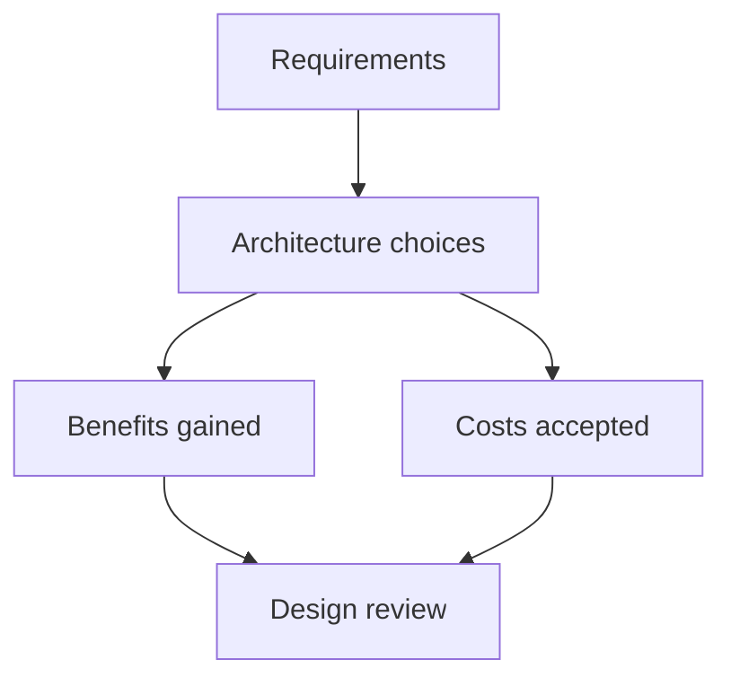

# Day 001: Architecture Trade-offs

Chapter 1 | Architecture inventory + trade-off matrix

Map a system you know into workloads, constraints, and the choices it made.

## Summary

Every data system is a bundle of trade-offs shaped by workload, team skills, and failure tolerance. Caches, queues, replicas, and batch pipelines each buy speed or resilience at the cost of complexity, staleness, or operational surface area. Naming those costs explicitly is the first step toward defensible architecture.

> These notes and diagrams are original study aids for this repo, not copies of DDIA figures or prose. Read the matching section in your own copy of the book.

## Key points

- Separate what must be authoritative from what can be rebuilt or approximated.
- Each component solves one pain point but introduces new failure modes and ops work.
- Trade-offs only make sense when tied to measurable requirements (latency, cost, team size).
- Removing a component often shifts pain rather than eliminating it. Know where it lands.

## Diagram

requirements drive choices; every benefit carries an accepted cost.



## Today

1. Read the matching DDIA section in your own copy of the book.
2. Skim [WORKFLOW.md](../WORKFLOW.md) if you need the shared checklist.
3. Run the starter, then do Try this / Break it / Measure.

### Run the starter

```bash
cd workbook/starter
python3 main.py --help
python3 main.py
```

See [workbook/starter/README.md](./workbook/starter/README.md).

### Try this

Pick an app you have shipped or used heavily. List its data stores, queues, caches, and batch jobs. For each, write one sentence: what problem it solves and what it costs.

### Break it

Remove one component on paper (cache, replica, queue). What breaks first for users?

### Measure

Rough order-of-magnitude: QPS, data size, p99 latency budget, and how many people operate it.

## Done when

- [ ] You can explain the idea simply
- [ ] You ran the starter and captured output
- [ ] You changed one variable or failure mode and noted what happened
- [ ] You wrote one trade-off you would defend in a design review

Workbook: [workbook/exercise.md](./workbook/exercise.md)
