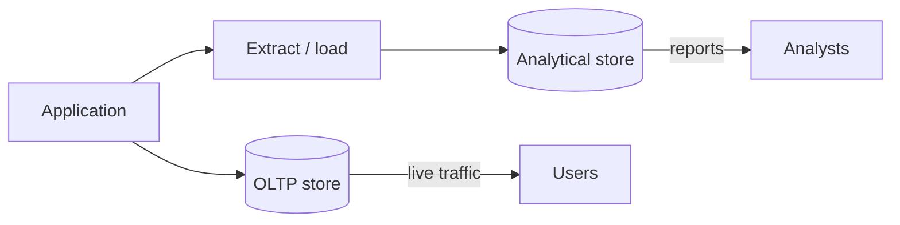

# Day 002: OLTP vs OLAP

Chapter 1 | Workload classifier

Separate transactional and analytical work and see why storage/access patterns diverge.

## Summary

Online transaction processing (OLTP) favors small, indexed reads and writes with strong consistency for live users. Online analytical processing (OLAP) favors large scans and aggregates, often on copies tuned for throughput over freshness. Mixing the two on one path creates contention, unpredictable latency, and schema designs that satisfy neither side.

> These notes and diagrams are original study aids for this repo, not copies of DDIA figures or prose. Read the matching section in your own copy of the book.

## Key points

- OLTP: point lookups, short transactions, low latency, many concurrent writers.
- OLAP: wide scans, aggregations, batch or columnar layouts, staleness often acceptable.
- Access pattern (point vs scan vs aggregate) predicts which engine fits.
- Running heavy analytics on the OLTP database starves transactional traffic.

## Diagram

transactional and analytical workloads usually follow separate storage paths.



## Today

1. Read the matching DDIA section in your own copy of the book.
2. Skim [WORKFLOW.md](../WORKFLOW.md) if you need the shared checklist.
3. Run the starter, then do Try this / Break it / Measure.

### Run the starter

```bash
cd workbook/starter
python3 main.py --help
python3 main.py
```

See [workbook/starter/README.md](./workbook/starter/README.md).

### Try this

Write 8 real queries/operations from a product (checkout, search, admin report, nightly export...). Label each OLTP or OLAP and note access pattern: point lookup, range, scan, aggregate.

### Break it

Force one OLAP query onto the OLTP path (or the reverse). What contention or cost shows up?

### Measure

Rows touched, latency class (ms vs seconds), and whether the query can tolerate staleness.

## Done when

- [ ] You can explain the idea simply
- [ ] You ran the starter and captured output
- [ ] You changed one variable or failure mode and noted what happened
- [ ] You wrote one trade-off you would defend in a design review

Workbook: [workbook/exercise.md](./workbook/exercise.md)
