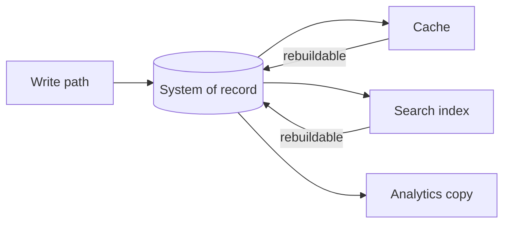

# Day 003: Systems of Record and Derived Data

Chapter 1 | Data lineage diagram

Trace what is authoritative vs what is derived.

## Summary

The system of record holds authoritative state; every other copy, cache, search index, analytics table, is derived. Derived data can usually be rebuilt from the source, but rebuild time and staleness windows define user-visible risk. Treating a derived store as truth is how teams ship subtle consistency bugs.

> These notes and diagrams are original study aids for this repo, not copies of DDIA figures or prose. Read the matching section in your own copy of the book.

## Key points

- One write path should land in the system of record; everything else follows by pipeline or sync.
- Derived stores trade freshness for speed or query shape; document the acceptable lag.
- Rebuild procedures and monitoring turn 'we can recreate it' into an operational guarantee.
- Corrupting derived data is painful; corrupting the source of truth is catastrophic.

## Diagram

authoritative writes land once; derived copies rebuild from the source.



## Today

1. Read the matching DDIA section in your own copy of the book.
2. Skim [WORKFLOW.md](../WORKFLOW.md) if you need the shared checklist.
3. Run the starter, then do Try this / Break it / Measure.

### Run the starter

```bash
cd workbook/starter
python3 main.py --help
python3 main.py
```

See [workbook/starter/README.md](./workbook/starter/README.md).

### Try this

Draw a lineage from write -> system of record -> caches/search indexes/analytics. Mark which copies can be rebuilt and which cannot.

### Break it

Corrupt or delete a derived store. How do you rebuild? How long until users notice?

### Measure

Rebuild time, staleness window, and blast radius if the source of truth is wrong.

## Done when

- [ ] You can explain the idea simply
- [ ] You ran the starter and captured output
- [ ] You changed one variable or failure mode and noted what happened
- [ ] You wrote one trade-off you would defend in a design review

Workbook: [workbook/exercise.md](./workbook/exercise.md)
