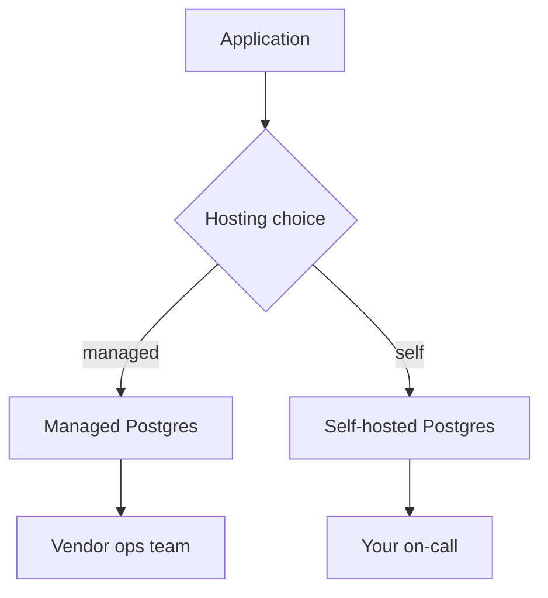

# Day 004: Cloud vs Self-Hosted

Chapter 1 | Architecture decision record

Compare control, cost, failure domains, and managed-service trade-offs.

## Summary

Managed cloud databases trade capital expense and hiring for a vendor's operational envelope. Self-hosted Postgres buys control and predictable unit economics at the cost of patches, backups, and paging humans. The right choice depends on failure-domain ownership, compliance, and how much toil your team can absorb.

> These notes and diagrams are original study aids for this repo, not copies of DDIA figures or prose. Read the matching section in your own copy of the book.

## Key points

- Managed services shift RTO/RPO work to a vendor but add region and noisy-neighbor dependencies.
- Self-hosted gives fine-grained tuning and data residency; you own every outage.
- Cost is not only monthly bill. Include engineer hours, training, and incident time.
- ADR documents should name who gets paged for each failure domain.

## Diagram

hosting choice shifts who owns recovery and operational toil.



## Today

1. Read the matching DDIA section in your own copy of the book.
2. Skim [WORKFLOW.md](../WORKFLOW.md) if you need the shared checklist.
3. Run the starter, then do Try this / Break it / Measure.

### Run the starter

```bash
cd workbook/starter
python3 main.py --help
python3 main.py
```

See [workbook/starter/README.md](./workbook/starter/README.md).

### Try this

Write a one-page ADR for Postgres: managed vs self-hosted for a mid-size product. Include failure domains and who gets paged.

### Break it

Assume a region outage or a noisy-neighbor incident. Who owns recovery in each option?

### Measure

Monthly cost ballpark, RTO/RPO, and ops hours/week.

## Done when

- [ ] You can explain the idea simply
- [ ] You ran the starter and captured output
- [ ] You changed one variable or failure mode and noted what happened
- [ ] You wrote one trade-off you would defend in a design review

Workbook: [workbook/exercise.md](./workbook/exercise.md)
