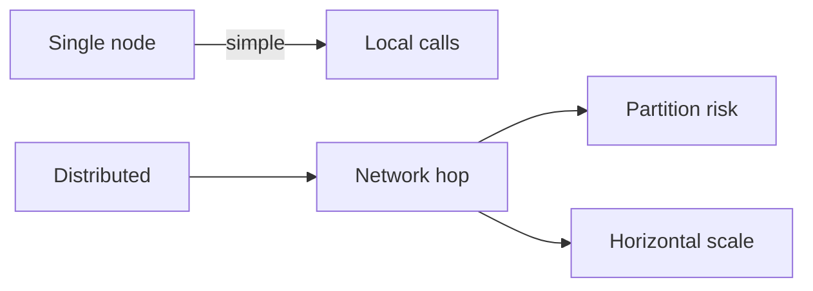

# Day 005: Distributed vs Single Node

Chapter 1 | Failure-mode comparison

Find where distribution helps and where it mostly adds failure modes.

## Summary

Distribution spreads load and failure domains but adds network hops, partial failures, and coordination. A single beefy node often satisfies early requirements with far fewer moving parts. The question is not 'distributed or not' but which pain you are buying: capacity limits or operational complexity.

> These notes and diagrams are original study aids for this repo, not copies of DDIA figures or prose. Read the matching section in your own copy of the book.

## Key points

- Local function calls become RPCs. Latency and failure modes multiply.
- Network partitions create split-brain and stale-read bugs that cannot happen on one machine.
- Distribution helps when CPU, disk, or blast radius exceed one box.
- Many systems distribute too early and pay coordination tax without needing it.

## Diagram

distribution trades local simplicity for network hops and partition risk.



## Today

1. Read the matching DDIA section in your own copy of the book.
2. Skim [WORKFLOW.md](../WORKFLOW.md) if you need the shared checklist.
3. Run the starter, then do Try this / Break it / Measure.

### Run the starter

```bash
cd workbook/starter
python3 main.py --help
python3 main.py
```

See [workbook/starter/README.md](./workbook/starter/README.md).

### Try this

Take a single-node design that fits on one beefy machine. List three reasons to distribute and three reasons not to.

### Break it

Add a network partition between two pieces that used to be local calls. What new user-visible bugs appear?

### Measure

Latency added by the network hop, and number of new failure cases you can name.

## Done when

- [ ] You can explain the idea simply
- [ ] You ran the starter and captured output
- [ ] You changed one variable or failure mode and noted what happened
- [ ] You wrote one trade-off you would defend in a design review

Workbook: [workbook/exercise.md](./workbook/exercise.md)
