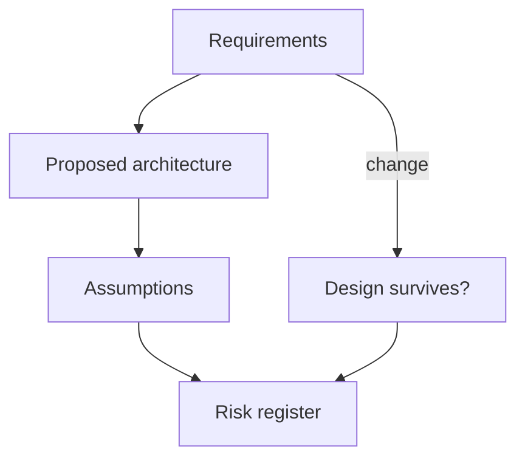

# Day 006: Architecture Review

Chapter 1 | Mini design review

Turn requirements into an explicit decision with assumptions written down.

## Summary

A design review turns implicit assumptions into explicit statements that can be tested. Requirements like QPS, read/write ratio, and ops appetite constrain viable architectures. Changing one requirement, multi-region writes, for example, often invalidates half the proposal.

> These notes and diagrams are original study aids for this repo, not copies of DDIA figures or prose. Read the matching section in your own copy of the book.

## Key points

- Write assumptions down: traffic shape, consistency needs, team skills, budget.
- Every architecture is optimal for one scenario and fragile for another.
- Risk lists should rank likelihood × impact, not only enumerate fears.
- Surviving a requirement change is a good test of design robustness.

## Diagram

requirements and assumptions feed a risk register.



## Today

1. Read the matching DDIA section in your own copy of the book.
2. Skim [WORKFLOW.md](../WORKFLOW.md) if you need the shared checklist.
3. Run the starter, then do Try this / Break it / Measure.

### Run the starter

```bash
cd workbook/starter
python3 main.py --help
python3 main.py
```

See [workbook/starter/README.md](./workbook/starter/README.md).

### Try this

Given: 5k writes/s, 50k reads/s, multi-region users, strong preference for simple ops. Propose one architecture and list assumptions that would invalidate it.

### Break it

Change one requirement (e.g. multi-region writes). How much of the design survives?

### Measure

A short risk list ranked by likelihood × impact.

## Done when

- [ ] You can explain the idea simply
- [ ] You ran the starter and captured output
- [ ] You changed one variable or failure mode and noted what happened
- [ ] You wrote one trade-off you would defend in a design review

Workbook: [workbook/exercise.md](./workbook/exercise.md)
