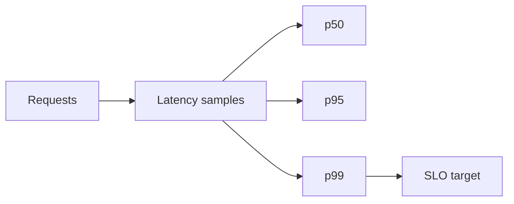

# Day 007: Latency and Percentiles

Chapter 2 | Load test + percentile analysis

Measure latency distributions instead of hiding behind averages.

## Summary

Averages hide tail latency: a few slow requests dominate user perception for interactive workloads. Percentiles (p50, p95, p99) describe the distribution of experience across requests. SLOs and capacity plans should target percentiles, not means.

> These notes and diagrams are original study aids for this repo, not copies of DDIA figures or prose. Read the matching section in your own copy of the book.

## Key points

- p50 is the typical case; p99 captures the worst 1% users still hit regularly.
- A 1% slow path can barely move the mean but double p99.
- Histograms reveal multimodal latency (cache hit vs miss).
- Measure under representative load, not idle localhost pings.

## Diagram

percentile metrics drive SLO targets, not averages alone.



## Today

1. Read the matching DDIA section in your own copy of the book.
2. Skim [WORKFLOW.md](../WORKFLOW.md) if you need the shared checklist.
3. Run the starter, then do Try this / Break it / Measure.

### Run the starter

```bash
cd workbook/starter
python3 main.py --help
python3 main.py
```

See [workbook/starter/README.md](./workbook/starter/README.md).

### Try this

Hit a tiny HTTP or local function under load. Record mean, p50, p95, p99. Plot or print a histogram.

### Break it

Add a 1% slow path (sleep/GC/lock). Watch how averages lie and tails move.

### Measure

p50/p95/p99 before and after; max observed latency.

## Done when

- [ ] You can explain the idea simply
- [ ] You ran the starter and captured output
- [ ] You changed one variable or failure mode and noted what happened
- [ ] You wrote one trade-off you would defend in a design review

Workbook: [workbook/exercise.md](./workbook/exercise.md)
