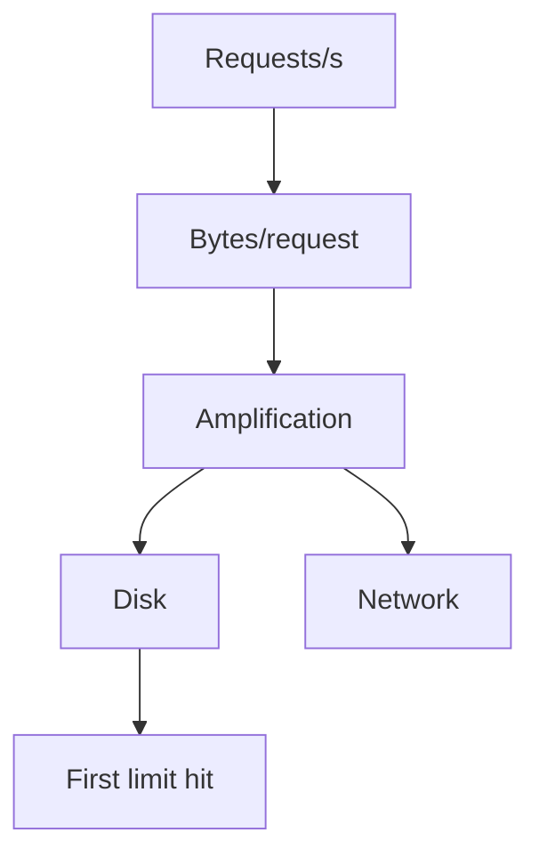

# Day 008: Throughput and Capacity

Chapter 2 | Capacity spreadsheet or script

Build a simple capacity model from rate, payload, and limits.

## Summary

Capacity planning multiplies request rate by payload size and write amplification to estimate disk and network demand. The first saturated resource. CPU, disk IOPS, network, or connections, sets the ceiling. Doubling indexes or replicas doubles write amplification and can move the bottleneck.

> These notes and diagrams are original study aids for this repo, not copies of DDIA figures or prose. Read the matching section in your own copy of the book.

## Key points

- Model: ops/s × bytes/op × amplification = bytes/s to disk or network.
- Sanity-check against one machine's published limits.
- Write amplification from indexes and replication is easy to forget.
- Headroom policy (e.g. 40% free) avoids running at the cliff edge.

## Diagram

amplification converts request rate into resource demand.



## Today

1. Read the matching DDIA section in your own copy of the book.
2. Skim [WORKFLOW.md](../WORKFLOW.md) if you need the shared checklist.
3. Run the starter, then do Try this / Break it / Measure.

### Run the starter

```bash
cd workbook/starter
python3 main.py --help
python3 main.py
```

See [workbook/starter/README.md](./workbook/starter/README.md).

### Try this

Model: requests/s × bytes × amplification = disk/network needed. Sanity-check against one machine's limits.

### Break it

Double write amplification (indexing, replication). Where do you hit the wall first?

### Measure

Sustained ops/s and the first saturated resource.

## Done when

- [ ] You can explain the idea simply
- [ ] You ran the starter and captured output
- [ ] You changed one variable or failure mode and noted what happened
- [ ] You wrote one trade-off you would defend in a design review

Workbook: [workbook/exercise.md](./workbook/exercise.md)
