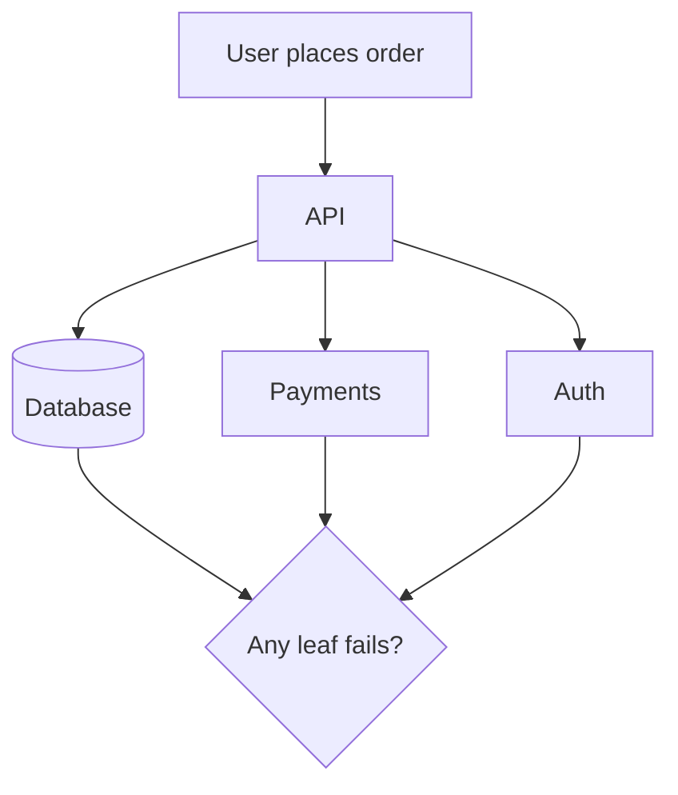

# Day 009: Reliability and Faults

Chapter 2 | Fault-tree sketch

Separate component reliability from system reliability and graceful degradation.

## Summary

Component reliability does not automatically yield system reliability. Graceful degradation keeps the core path working when non-critical dependencies fail. Fault trees make dependency chains visible and help estimate end-to-end availability.

> These notes and diagrams are original study aids for this repo, not copies of DDIA figures or prose. Read the matching section in your own copy of the book.

## Key points

- Map the user journey to dependencies: DB, payments, auth, CDN, third-party APIs.
- Non-critical failures should degrade features, not block checkout.
- Independent 99.9% components in series multiply downtime.
- Correlated failures (shared region, config) break naive availability math.

## Diagram

fault tree for a core user journey across dependencies.



## Today

1. Read the matching DDIA section in your own copy of the book.
2. Skim [WORKFLOW.md](../WORKFLOW.md) if you need the shared checklist.
3. Run the starter, then do Try this / Break it / Measure.

### Run the starter

```bash
cd workbook/starter
python3 main.py --help
python3 main.py
```

See [workbook/starter/README.md](./workbook/starter/README.md).

### Try this

Draw a fault tree for 'user cannot place an order'. Include deps (DB, payments, auth, CDN).

### Break it

Kill or mock-fail a non-critical dependency. Does the core path still work?

### Measure

Estimated availability if each leaf has 99.9% and failures are independent vs correlated.

## Done when

- [ ] You can explain the idea simply
- [ ] You ran the starter and captured output
- [ ] You changed one variable or failure mode and noted what happened
- [ ] You wrote one trade-off you would defend in a design review

Workbook: [workbook/exercise.md](./workbook/exercise.md)
