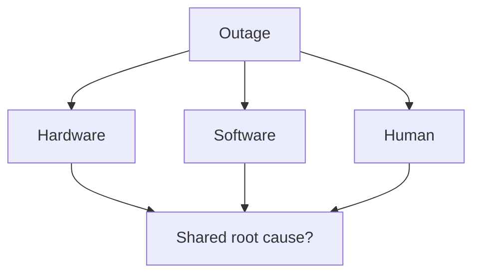

# Day 010: Hardware, Software, Human Faults

Chapter 2 | Failure injection plan

Model correlated vs independent failures.

## Summary

Failures come from hardware, software, and humans, and they often share root causes. A bad deploy and a wrong config flag are both human-triggered software failures. Runbooks must cover correlated scenarios, not only single-component random faults.

> These notes and diagrams are original study aids for this repo, not copies of DDIA figures or prose. Read the matching section in your own copy of the book.

## Key points

- Hardware: disk, NIC, power, rack. Often correlated in one AZ.
- Software: bugs, memory leaks, retry storms, version skew.
- Human: deploys, config edits, access mistakes, on-call fatigue.
- Shared root causes (region, config repo) create correlated outages.

## Diagram

hardware, software, and human faults may share a root cause.



## Today

1. Read the matching DDIA section in your own copy of the book.
2. Skim [WORKFLOW.md](../WORKFLOW.md) if you need the shared checklist.
3. Run the starter, then do Try this / Break it / Measure.

### Run the starter

```bash
cd workbook/starter
python3 main.py --help
python3 main.py
```

See [workbook/starter/README.md](./workbook/starter/README.md).

### Try this

List 10 failure modes across hardware, software, and humans (bad deploy, wrong config). Mark which ones share a root cause.

### Break it

Simulate a correlated failure (shared disk, shared config, shared region).

### Measure

MTTR estimate and whether your runbook covers the correlated case.

## Done when

- [ ] You can explain the idea simply
- [ ] You ran the starter and captured output
- [ ] You changed one variable or failure mode and noted what happened
- [ ] You wrote one trade-off you would defend in a design review

Workbook: [workbook/exercise.md](./workbook/exercise.md)
