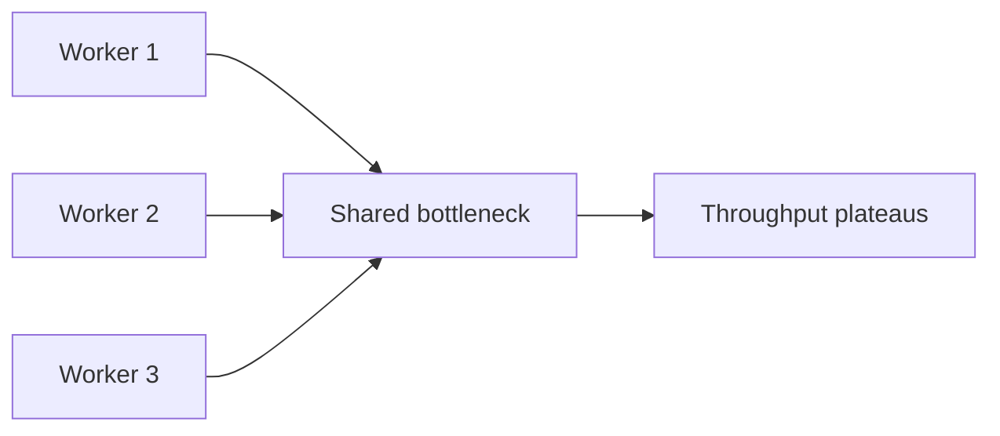

# Day 011: Scalability

Chapter 2 | Scale-out experiment

Find bottlenecks and test whether 'just add nodes' actually helps.

## Summary

Scalability is not linear by default: shared locks, single DB connections, and hot keys create bottlenecks. Adding workers helps only until the serial section dominates. Measure throughput vs workers to find the knee of the curve.

> These notes and diagrams are original study aids for this repo, not copies of DDIA figures or prose. Read the matching section in your own copy of the book.

## Key points

- Amdahl's law: serial sections cap speedup from parallel workers.
- Shared mutable state (one connection, one lock) serializes work.
- Efficiency = total_throughput / workers; values << 1 mean wasted scale-out.
- Scale up first when one node still fits; scale out when forced.

## Diagram

shared bottlenecks flatten throughput as workers increase.



## Today

1. Read the matching DDIA section in your own copy of the book.
2. Skim [WORKFLOW.md](../WORKFLOW.md) if you need the shared checklist.
3. Run the starter, then do Try this / Break it / Measure.

### Run the starter

```bash
cd workbook/starter
python3 main.py --help
python3 main.py
```

See [workbook/starter/README.md](./workbook/starter/README.md).

### Try this

Run a simple service with 1 worker, then 2-4. Measure throughput. Note what does not scale linearly.

### Break it

Make the bottleneck a shared lock or single DB connection. Confirm scaling plateaus.

### Measure

Throughput vs workers curve; efficiency = total_throughput / workers.

## Done when

- [ ] You can explain the idea simply
- [ ] You ran the starter and captured output
- [ ] You changed one variable or failure mode and noted what happened
- [ ] You wrote one trade-off you would defend in a design review

Workbook: [workbook/exercise.md](./workbook/exercise.md)
