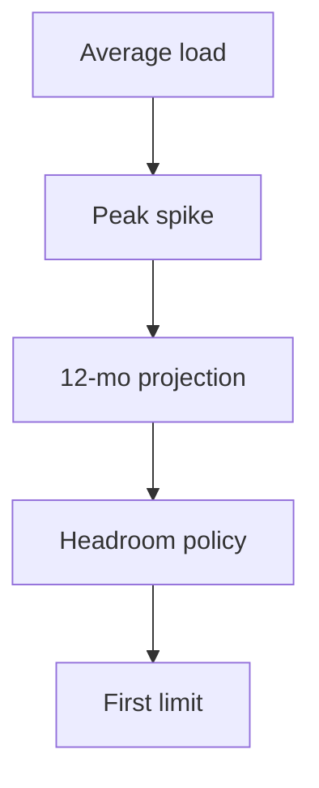

# Day 012: Load and Capacity Modeling

Chapter 2 | Capacity model

Estimate capacity under growth and how much headroom you need.

## Summary

Capacity models project storage, QPS, and connections under growth and spikes. Headroom policy (e.g. 40% unused) buys time for provisioning and incident response. Launch spikes often hit 10× average; know what sheds load first.

> These notes and diagrams are original study aids for this repo, not copies of DDIA figures or prose. Read the matching section in your own copy of the book.

## Key points

- Project 3× growth over 12 months for storage, QPS, and connections.
- Peak/average ratio drives provisioning, not average alone.
- First resource out: disk, connections, CPU, or egress bandwidth.
- Spikes need shedding: queue, rate limit, or degrade non-core features.

## Diagram

growth projection plus headroom finds the first resource limit.



## Today

1. Read the matching DDIA section in your own copy of the book.
2. Skim [WORKFLOW.md](../WORKFLOW.md) if you need the shared checklist.
3. Run the starter, then do Try this / Break it / Measure.

### Run the starter

```bash
cd workbook/starter
python3 main.py --help
python3 main.py
```

See [workbook/starter/README.md](./workbook/starter/README.md).

### Try this

Assume 3× traffic in 12 months. Project storage, QPS, and connection counts. Decide headroom policy (e.g. 40% unused).

### Break it

Spike to 10× for one hour (launch/event). What sheds load first?

### Measure

Peak vs average ratio and the first resource that runs out.

## Done when

- [ ] You can explain the idea simply
- [ ] You ran the starter and captured output
- [ ] You changed one variable or failure mode and noted what happened
- [ ] You wrote one trade-off you would defend in a design review

Workbook: [workbook/exercise.md](./workbook/exercise.md)
