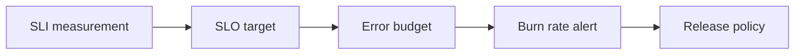

# Day 014: SLOs

Chapter 2 | SLO proposal

Turn vague 'it should be fast/reliable' into measurable objectives.

## Summary

SLOs translate user experience into measurable targets: availability, latency, or freshness. Error budgets balance reliability work against feature velocity. Burn-rate alerts catch budget exhaustion early, not after users complain.

> These notes and diagrams are original study aids for this repo, not copies of DDIA figures or prose. Read the matching section in your own copy of the book.

## Key points

- SLI = what you measure; SLO = target; SLA = contract (optional).
- Error budget = allowed unreliability over a window (e.g. 99.9% monthly).
- Fast burn should freeze risky releases and focus on reliability.
- Alert on budget burn rate, not every blip above SLO.

## Diagram

SLIs feed SLOs; error budget burn drives release policy.



## Today

1. Read the matching DDIA section in your own copy of the book.
2. Skim [WORKFLOW.md](../WORKFLOW.md) if you need the shared checklist.
3. Run the starter, then do Try this / Break it / Measure.

### Run the starter

```bash
cd workbook/starter
python3 main.py --help
python3 main.py
```

See [workbook/starter/README.md](./workbook/starter/README.md).

### Try this

Pick a user journey. Write SLIs, SLOs, and an error budget policy (what you stop doing when budget burns).

### Break it

Burn 50% of the monthly error budget in a week. What product work pauses?

### Measure

SLO target, measurement window, and alert that fires on burn rate, not only raw errors.

## Done when

- [ ] You can explain the idea simply
- [ ] You ran the starter and captured output
- [ ] You changed one variable or failure mode and noted what happened
- [ ] You wrote one trade-off you would defend in a design review

Workbook: [workbook/exercise.md](./workbook/exercise.md)
