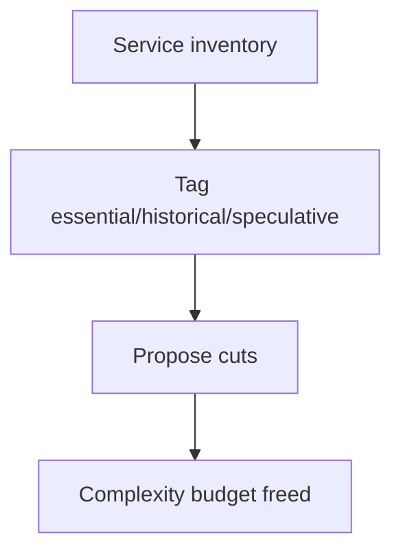

# Day 015: Complexity Budget

Chapter 2 | Simplification proposal

Find accidental complexity and propose cuts.

## Summary

Every component consumes a complexity budget: ops time, cognitive load, and incident surface. Tag services as essential, historical, or speculative to find cuts. Removing speculative pieces frees budget but may kill unused features quietly.

> These notes and diagrams are original study aids for this repo, not copies of DDIA figures or prose. Read the matching section in your own copy of the book.

## Key points

- Essential: core path breaks without it.
- Historical: solved a past problem; may be removable.
- Speculative: 'we might need it', prime cut candidates.
- Measure ops toil hours before and after simplification.

## Diagram

inventory and tagging reveal complexity budget to reclaim.



## Today

1. Read the matching DDIA section in your own copy of the book.
2. Skim [WORKFLOW.md](../WORKFLOW.md) if you need the shared checklist.
3. Run the starter, then do Try this / Break it / Measure.

### Run the starter

```bash
cd workbook/starter
python3 main.py --help
python3 main.py
```

See [workbook/starter/README.md](./workbook/starter/README.md).

### Try this

Inventory services/stores in a system you know. Tag each as essential, historical, or speculative. Propose removing or merging two.

### Break it

If you delete the speculative piece, what features die, and who notices?

### Measure

Ops toil hours/week before vs after the cut.

## Done when

- [ ] You can explain the idea simply
- [ ] You ran the starter and captured output
- [ ] You changed one variable or failure mode and noted what happened
- [ ] You wrote one trade-off you would defend in a design review

Workbook: [workbook/exercise.md](./workbook/exercise.md)
