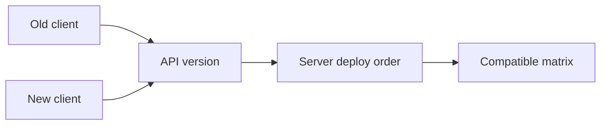

# Day 016: Evolvability

Chapter 2 | Evolution plan

Design so change does not require a synchronized rewrite.

## Summary

Evolvable systems allow producers and consumers to upgrade independently. Backwards-compatible schema changes and versioned APIs avoid big-bang deploys. Deploy order matters: consumers-first vs producers-first breaks different assumptions.

> These notes and diagrams are original study aids for this repo, not copies of DDIA figures or prose. Read the matching section in your own copy of the book.

## Key points

- Add optional fields before requiring them; old readers ignore unknown fields.
- Version endpoints or use compatibility layers during migration.
- Consumers-first safe for additive changes; producers-first risky.
- Compatibility matrix: old/new client × old/new server.

## Diagram

deploy order determines client/server compatibility.



## Today

1. Read the matching DDIA section in your own copy of the book.
2. Skim [WORKFLOW.md](../WORKFLOW.md) if you need the shared checklist.
3. Run the starter, then do Try this / Break it / Measure.

### Run the starter

```bash
cd workbook/starter
python3 main.py --help
python3 main.py
```

See [workbook/starter/README.md](./workbook/starter/README.md).

### Try this

Plan a backwards-compatible change (new field, new endpoint version). Sequence deploys for producer and consumer.

### Break it

Deploy consumers first vs producers first. Which order breaks?

### Measure

Compatibility matrix: old/new client × old/new server.

## Done when

- [ ] You can explain the idea simply
- [ ] You ran the starter and captured output
- [ ] You changed one variable or failure mode and noted what happened
- [ ] You wrote one trade-off you would defend in a design review

Workbook: [workbook/exercise.md](./workbook/exercise.md)
