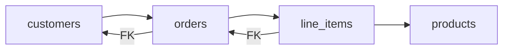

# Day 017: Relational Modeling

Chapter 3 | PostgreSQL schema

Model a domain with normalized tables and real constraints.

## Summary

Relational modeling enforces structure with primary keys, foreign keys, and constraints. Normalization reduces update anomalies; constraints catch invalid data at write time. Orders, line items, and customers are the classic teaching domain.

> These notes and diagrams are original study aids for this repo, not copies of DDIA figures or prose. Read the matching section in your own copy of the book.

## Key points

- PKs identify rows; FKs enforce referential integrity.
- NOT NULL and CHECK constraints reject bad data early.
- Orphan rows and negative quantities are constraint violations.
- Normalized schemas make some reads harder, that is a trade-off, not a flaw.

## Diagram

normalized orders domain with foreign-key relationships.



## Today

1. Read the matching DDIA section in your own copy of the book.
2. Skim [WORKFLOW.md](../WORKFLOW.md) if you need the shared checklist.
3. Run the starter, then do Try this / Break it / Measure.

### Run the starter

```bash
cd workbook/starter
python3 main.py --help
python3 main.py
```

See [workbook/starter/README.md](./workbook/starter/README.md).

### Try this

Model orders + line items + customers in Postgres with PKs, FKs, and NOT NULL where it matters. Insert valid and invalid rows.

### Break it

Try to insert orphan line items or negative quantities. Which constraints catch them?

### Measure

Constraint list and one query that would be painful if denormalized early.

## Done when

- [ ] You can explain the idea simply
- [ ] You ran the starter and captured output
- [ ] You changed one variable or failure mode and noted what happened
- [ ] You wrote one trade-off you would defend in a design review

Workbook: [workbook/exercise.md](./workbook/exercise.md)
