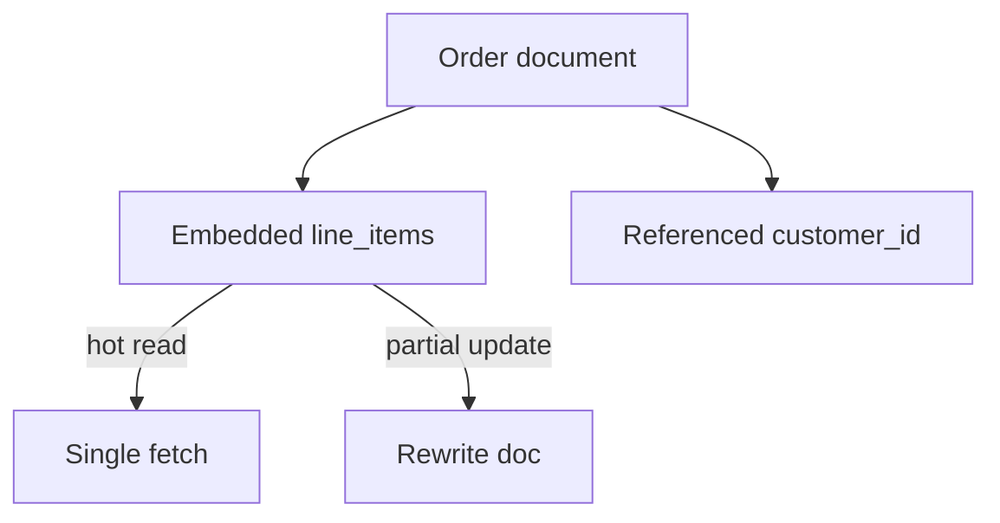

# Day 018: Document Modeling

Chapter 3 | Document schema

Model the same domain as documents and find aggregate boundaries.

## Summary

Document models embed related data for read efficiency but complicate partial updates. Aggregate boundaries follow access patterns: embed what you read together, reference what changes independently. Updating one line item across 10k orders signals a wrong boundary.

> These notes and diagrams are original study aids for this repo, not copies of DDIA figures or prose. Read the matching section in your own copy of the book.

## Key points

- Documents trade join cost for read amplification control.
- Embedded arrays speed reads; scattered updates are painful.
- SQLite JSON or JSON files work for study without Mongo.
- Boundary signals: update fan-out and document size growth.

## Diagram

embedding speeds reads but makes partial updates costly.



## Today

1. Read the matching DDIA section in your own copy of the book.
2. Skim [WORKFLOW.md](../WORKFLOW.md) if you need the shared checklist.
3. Run the starter, then do Try this / Break it / Measure.

### Run the starter

```bash
cd workbook/starter
python3 main.py --help
python3 main.py
```

See [workbook/starter/README.md](./workbook/starter/README.md).

### Try this

Store an order as a document (JSON file or Mongo/SQLite JSON). Decide what is embedded vs referenced.

### Break it

Update one line item across 10k orders. Painful? That is your boundary signal.

### Measure

Read amplification for common queries; write cost for partial updates.

## Done when

- [ ] You can explain the idea simply
- [ ] You ran the starter and captured output
- [ ] You changed one variable or failure mode and noted what happened
- [ ] You wrote one trade-off you would defend in a design review

Workbook: [workbook/exercise.md](./workbook/exercise.md)
