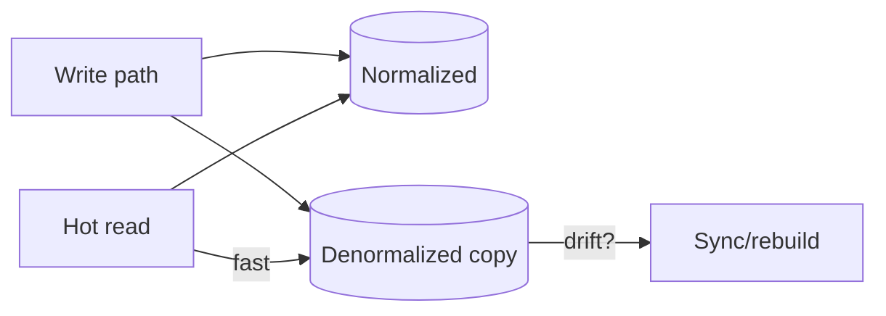

# Day 019: Normalization vs Denormalization

Chapter 3 | Benchmark

Measure the read/write trade-off of duplicated data.

## Summary

Normalization keeps writes single-sourced; denormalization duplicates data for read speed. Every denormalized copy needs an invalidation or update strategy. Benchmark both designs on your actual hot read and write paths.

> These notes and diagrams are original study aids for this repo, not copies of DDIA figures or prose. Read the matching section in your own copy of the book.

## Key points

- Normalized: join on read, single update path on write.
- Denormalized: fast read, multiple writes or drift risk.
- Drift detection: checksums, periodic rebuild, or triggers.
- Choose based on measured read/write ratio, not ideology.

## Diagram

denormalized copies speed reads but need sync discipline.



## Today

1. Read the matching DDIA section in your own copy of the book.
2. Skim [WORKFLOW.md](../WORKFLOW.md) if you need the shared checklist.
3. Run the starter, then do Try this / Break it / Measure.

### Run the starter

```bash
cd workbook/starter
python3 main.py --help
python3 main.py
```

See [workbook/starter/README.md](./workbook/starter/README.md).

### Try this

Implement both a normalized schema and a denormalized 'order summary' field/table. Benchmark a hot read and a write that invalidates the copy.

### Break it

Forget to update the denormalized copy. How do you detect drift?

### Measure

Read latency and write latency for both designs.

## Done when

- [ ] You can explain the idea simply
- [ ] You ran the starter and captured output
- [ ] You changed one variable or failure mode and noted what happened
- [ ] You wrote one trade-off you would defend in a design review

Workbook: [workbook/exercise.md](./workbook/exercise.md)
