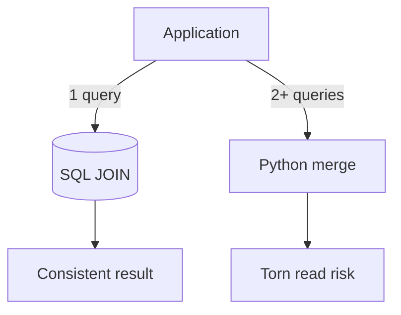

# Day 020: Joins

Chapter 3 | Query benchmark

Compare application-side joins with database joins.

## Summary

Database joins execute close to data with one round-trip and consistent snapshot visibility. Application-side joins fetch separately and merge in memory, more round-trips and torn-read risk under concurrency. Compare latency and correctness, not only lines of code.

> These notes and diagrams are original study aids for this repo, not copies of DDIA figures or prose. Read the matching section in your own copy of the book.

## Key points

- SQL join: one query, planner optimizes, transactional snapshot.
- App join: N+1 queries or two-step fetch; watch stale combinations.
- Round-trip count dominates on high-latency networks.
- Concurrent updates between fetches create torn reads in app joins.

## Diagram

SQL join vs application-side join trade-offs.



## Today

1. Read the matching DDIA section in your own copy of the book.
2. Skim [WORKFLOW.md](../WORKFLOW.md) if you need the shared checklist.
3. Run the starter, then do Try this / Break it / Measure.

### Run the starter

```bash
cd workbook/starter
python3 main.py --help
python3 main.py
```

See [workbook/starter/README.md](./workbook/starter/README.md).

### Try this

Same data: join in SQL vs fetch + join in Python/Go. Compare latency and correctness under concurrent updates.

### Break it

Under concurrent writes, does the app-side join see a torn read the DB join would not?

### Measure

Latency and number of round-trips.

## Done when

- [ ] You can explain the idea simply
- [ ] You ran the starter and captured output
- [ ] You changed one variable or failure mode and noted what happened
- [ ] You wrote one trade-off you would defend in a design review

Workbook: [workbook/exercise.md](./workbook/exercise.md)
