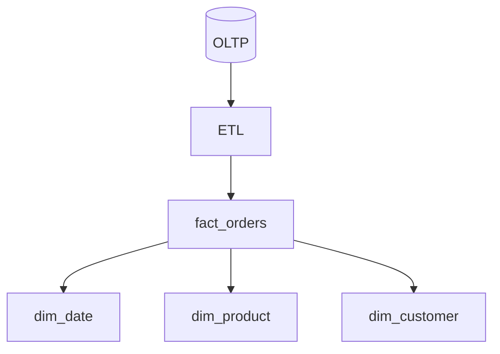

# Day 021: Analytical Schemas

Chapter 3 | ETL + analytical queries

Build a small star schema from operational data.

## Summary

Star schemas separate facts (events, measures) from dimensions (descriptive attributes). ETL transforms operational rows into analytical shape optimized for aggregations. Slowly changing dimensions require explicit policy when history must stay correct.

> These notes and diagrams are original study aids for this repo, not copies of DDIA figures or prose. Read the matching section in your own copy of the book.

## Key points

- Fact table: grain (one row per order line) and numeric measures.
- Dimension tables: time, product, customer attributes for filtering/grouping.
- SCD Type 1 overwrites; Type 2 preserves history with new rows.
- Analytical queries scan fewer columns than OLTP point lookups.

## Diagram

ETL builds a star schema from operational data.



## Today

1. Read the matching DDIA section in your own copy of the book.
2. Skim [WORKFLOW.md](../WORKFLOW.md) if you need the shared checklist.
3. Run the starter, then do Try this / Break it / Measure.

### Run the starter

```bash
cd workbook/starter
python3 main.py --help
python3 main.py
```

See [workbook/starter/README.md](./workbook/starter/README.md).

### Try this

Export a few fact/dimension tables (orders, date, product). Run 3 analytical queries.

### Break it

Add a slowly changing dimension (product rename). Do historical reports stay correct?

### Measure

Query time and row counts scanned.

## Done when

- [ ] You can explain the idea simply
- [ ] You ran the starter and captured output
- [ ] You changed one variable or failure mode and noted what happened
- [ ] You wrote one trade-off you would defend in a design review

Workbook: [workbook/exercise.md](./workbook/exercise.md)
