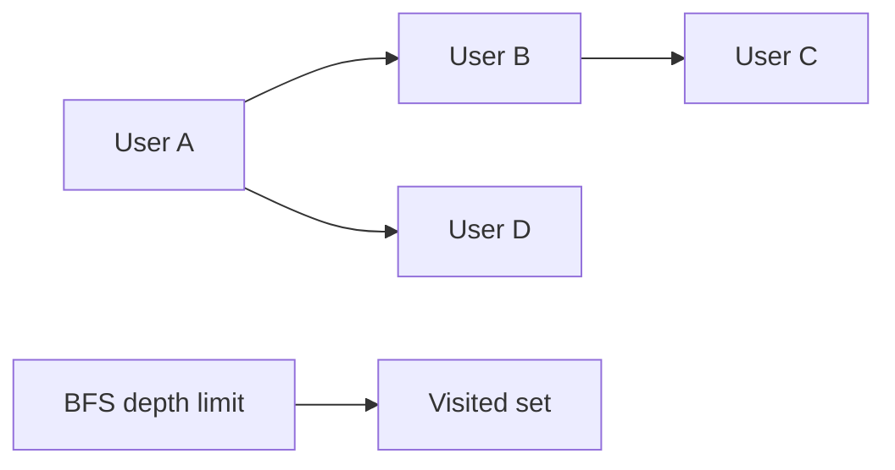

# Day 022: Graph Modeling

Chapter 3 | Graph traversal lab

Model relationships and traverse them without melting down.

## Summary

Graph data is nodes and edges; traversals follow relationships with depth limits. Relational tables (adjacency list or edge table) can model graphs for small studies. Dense graphs without depth limits explode in runtime and memory.

> These notes and diagrams are original study aids for this repo, not copies of DDIA figures or prose. Read the matching section in your own copy of the book.

## Key points

- BFS/DFS with max depth bounds friends-of-friends queries.
- Edge tables scale better than adjacency in SQL for many queries.
- Dense graphs: visited set and depth limit are mandatory.
- Measure nodes/edges visited vs depth.

## Diagram

bounded BFS traversal with a visited set.



## Today

1. Read the matching DDIA section in your own copy of the book.
2. Skim [WORKFLOW.md](../WORKFLOW.md) if you need the shared checklist.
3. Run the starter, then do Try this / Break it / Measure.

### Run the starter

```bash
cd workbook/starter
python3 main.py --help
python3 main.py
```

See [workbook/starter/README.md](./workbook/starter/README.md).

### Try this

Model users↔users follows (or parts↔BOM) in tables or a graph store. Implement friends-of-friends or transitive deps with a depth limit.

### Break it

Remove the depth limit on a dense graph. What happens to runtime/memory?

### Measure

Nodes/edges visited and latency vs depth.

## Done when

- [ ] You can explain the idea simply
- [ ] You ran the starter and captured output
- [ ] You changed one variable or failure mode and noted what happened
- [ ] You wrote one trade-off you would defend in a design review

Workbook: [workbook/exercise.md](./workbook/exercise.md)
