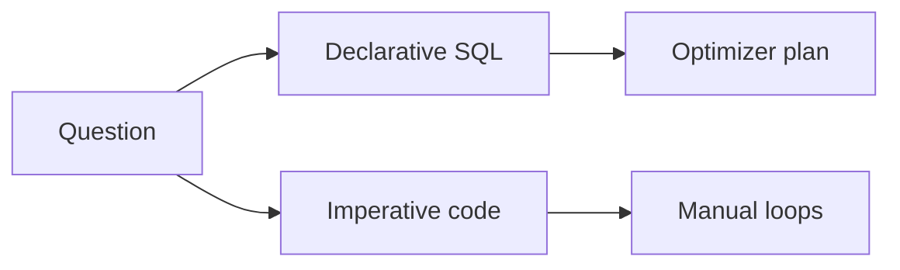

# Day 023: Query Language Trade-offs

Chapter 3 | Query comparison

Compare declarative vs imperative for the same task.

## Summary

Declarative SQL states what data you want; the engine plans how to get it. Imperative code over arrays/files states how step-by-step, and embeds optimization choices. Small question changes are easier in SQL; imperative code can hide correctness footguns.

> These notes and diagrams are original study aids for this repo, not copies of DDIA figures or prose. Read the matching section in your own copy of the book.

## Key points

- SQL: optimizer, set semantics, fewer round-trips.
- Imperative: explicit loops, easier for custom control flow, more bugs on change.
- Footgun SQL: NULL handling, accidental cross join.
- Footgun imperative: off-by-one, mutable state, filter order.

## Diagram

same question via declarative SQL or imperative loops.



## Today

1. Read the matching DDIA section in your own copy of the book.
2. Skim [WORKFLOW.md](../WORKFLOW.md) if you need the shared checklist.
3. Run the starter, then do Try this / Break it / Measure.

### Run the starter

```bash
cd workbook/starter
python3 main.py --help
python3 main.py
```

See [workbook/starter/README.md](./workbook/starter/README.md).

### Try this

Express one analytics question in SQL and again as imperative code over files/arrays. Note where each is clearer or safer.

### Break it

Change the question slightly (extra filter/group). Which form is easier to evolve without bugs?

### Measure

Lines of code, and one correctness footgun in each style.

## Done when

- [ ] You can explain the idea simply
- [ ] You ran the starter and captured output
- [ ] You changed one variable or failure mode and noted what happened
- [ ] You wrote one trade-off you would defend in a design review

Workbook: [workbook/exercise.md](./workbook/exercise.md)
