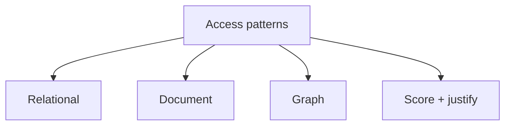

# Day 024: Model Selection

Chapter 3 | Design memo

Choose a data model from access patterns, not habit.

## Summary

Model selection starts from access patterns: point lookups, graph traversals, document fetch, aggregations. No single model wins all five top queries, justify with patterns, not brand preference. New access patterns may force hybrid or migration.

> These notes and diagrams are original study aids for this repo, not copies of DDIA figures or prose. Read the matching section in your own copy of the book.

## Key points

- List top queries and label: point, range, aggregate, traverse, document.
- Relational: joins and constraints; document: embed; graph: traverse.
- Hybrid systems are normal: OLTP + search + analytics.
- When a new pattern fights your model, adapt or add a specialized store.

## Diagram

access patterns drive model selection scoring.



## Today

1. Read the matching DDIA section in your own copy of the book.
2. Skim [WORKFLOW.md](../WORKFLOW.md) if you need the shared checklist.
3. Run the starter, then do Try this / Break it / Measure.

### Run the starter

```bash
cd workbook/starter
python3 main.py --help
python3 main.py
```

See [workbook/starter/README.md](./workbook/starter/README.md).

### Try this

Given access patterns for a social feed, pick relational, document, or graph, and justify with patterns, not brand preference.

### Break it

Add a new access pattern that fights your choice. What do you change?

### Measure

Top 5 queries and which model makes each cheap.

## Done when

- [ ] You can explain the idea simply
- [ ] You ran the starter and captured output
- [ ] You changed one variable or failure mode and noted what happened
- [ ] You wrote one trade-off you would defend in a design review

Workbook: [workbook/exercise.md](./workbook/exercise.md)
