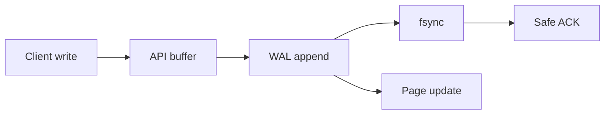

# Day 025: Storage Engine Basics

Chapter 4 | Write-path diagram

Trace a write from API call to durable bytes.

## Summary

A storage engine write path moves from API call through buffer, WAL append, and fsync to durable pages. The client ACK timing defines your durability guarantee, before fsync means crash can lose data. Understanding the path prevents claiming guarantees the engine does not provide.

> These notes and diagrams are original study aids for this repo, not copies of DDIA figures or prose. Read the matching section in your own copy of the book.

## Key points

- WAL: append log first; pages updated later for crash recovery.
- fsync forces durable media; skipping it trades speed for loss risk.
- ACK after fsync = strong durability; ACK after buffer = window of loss.
- Diagram the path and mark the 'safe after crash' point.

## Diagram

write path from client through WAL fsync to durable ACK.



## Today

1. Read the matching DDIA section in your own copy of the book.
2. Skim [WORKFLOW.md](../WORKFLOW.md) if you need the shared checklist.
3. Run the starter, then do Try this / Break it / Measure.

### Run the starter

```bash
cd workbook/starter
python3 main.py --help
python3 main.py
```

See [workbook/starter/README.md](./workbook/starter/README.md).

### Try this

Diagram: client -> API -> WAL/fsync -> pages/files. Annotate when the write is 'safe' after a crash.

### Break it

Kill the process between ACK and fsync (or skip fsync). What is lost?

### Measure

Durability guarantee you actually have, in one sentence.

## Done when

- [ ] You can explain the idea simply
- [ ] You ran the starter and captured output
- [ ] You changed one variable or failure mode and noted what happened
- [ ] You wrote one trade-off you would defend in a design review

Workbook: [workbook/exercise.md](./workbook/exercise.md)
