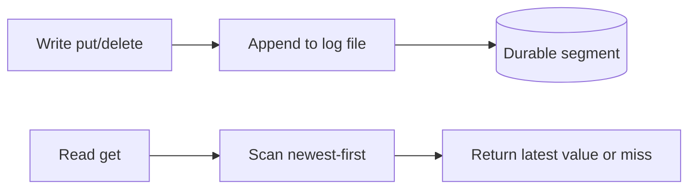

# Day 026: Log-Structured Storage

Chapter 4 | Mini KV store

Implement a tiny append-only key-value store.

## Summary

Log-structured storage treats the write path as sequential appends instead of in-place updates. Each put appends a new record; reads scan backward to find the newest value for a key. Deletes are usually tombstones, another append that marks a key gone. The trade-off is fast writes and simple crash recovery at the cost of read amplification as the log grows.

> These notes and diagrams are original study aids for this repo, not copies of DDIA figures or prose. Read the matching section in your own copy of the book.

## Key points

- Writes are append-only; the latest record for a key wins on read.
- Tombstones represent deletes without rewriting older entries in place.
- Recovery replays the log from start to end (or scans backward on get).
- Space amplification grows until compaction or garbage collection runs.

## Diagram

append-only write path and backward scan read path for a mini KV log.



## Today

1. Read the matching DDIA section in your own copy of the book.
2. Skim [WORKFLOW.md](../WORKFLOW.md) if you need the shared checklist.
3. Run the starter, then do Try this / Break it / Measure.

### Run the starter

```bash
cd workbook/starter
python3 main.py --help
python3 main.py
```

See [workbook/starter/README.md](./workbook/starter/README.md).

### Try this

Append `key=value\n` to a file; on read, scan from the end for the latest key. Support overwrite and crude delete.

### Break it

Crash mid-append (truncate the last line). Does startup recover cleanly?

### Measure

Read latency vs file size; space amplification after many overwrites.

## Done when

- [ ] You can explain the idea simply
- [ ] You ran the starter and captured output
- [ ] You changed one variable or failure mode and noted what happened
- [ ] You wrote one trade-off you would defend in a design review

Workbook: [workbook/exercise.md](./workbook/exercise.md)
