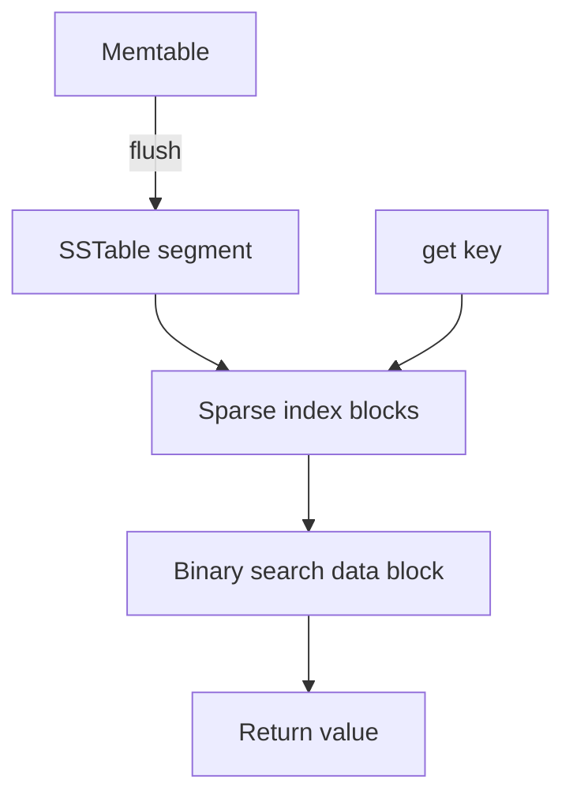

# Day 027: SSTables

Chapter 4 | SSTable prototype

Build immutable sorted segments and lookups.

## Summary

An SSTable is an immutable sorted file of key-value pairs with a sparse index for fast lookups. Memtables buffer writes in memory; when full, they flush to disk as sorted, unchangeable segments. Point reads binary-search within a segment and use index blocks to skip large ranges. Because segments never mutate, concurrent reads are simple and caching is effective.

> These notes and diagrams are original study aids for this repo, not copies of DDIA figures or prose. Read the matching section in your own copy of the book.

## Key points

- Segments are sorted on disk and never modified after creation.
- Sparse indexes store periodic key->offset anchors to bound binary search.
- Flushing converts random memory writes into one sequential disk write.
- Lookups may still scan a small range within a data block after the index hop.

## Diagram

memtable flush to immutable SSTable with sparse index guided lookup.



## Today

1. Read the matching DDIA section in your own copy of the book.
2. Skim [WORKFLOW.md](../WORKFLOW.md) if you need the shared checklist.
3. Run the starter, then do Try this / Break it / Measure.

### Run the starter

```bash
cd workbook/starter
python3 main.py --help
python3 main.py
```

See [workbook/starter/README.md](./workbook/starter/README.md).

### Try this

Flush a memtable to a sorted file with a sparse index. Implement get() using the index + scan.

### Break it

Lookup a missing key in a large segment. How much I/O did you do?

### Measure

Bytes read per get; flush size vs lookup cost.

## Done when

- [ ] You can explain the idea simply
- [ ] You ran the starter and captured output
- [ ] You changed one variable or failure mode and noted what happened
- [ ] You wrote one trade-off you would defend in a design review

Workbook: [workbook/exercise.md](./workbook/exercise.md)
