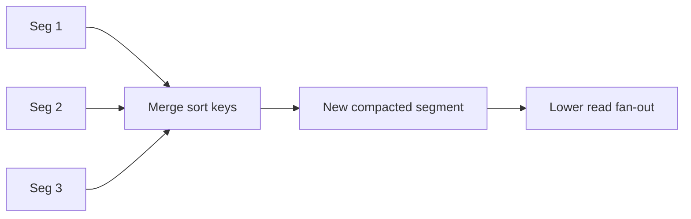

# Day 028: Compaction

Chapter 4 | Compaction benchmark

Measure how compaction strategy affects space and reads.

## Summary

LSM engines accumulate many overlapping SSTables; compaction merges them into fewer, non-overlapping files. Without compaction, reads must check every segment (read amplification explodes). Compaction reclaims space by dropping superseded keys and tombstones once they are safe to purge. The cost is background CPU and I/O spikes that must be budgeted in production.

> These notes and diagrams are original study aids for this repo, not copies of DDIA figures or prose. Read the matching section in your own copy of the book.

## Key points

- Multiple segments overlap in key ranges until compaction merges them.
- Read fan-out equals the number of segments consulted per get.
- Compaction removes stale versions and tombstones to shrink disk use.
- Strategy choices trade write amplification, read amplification, and latency spikes.

## Diagram

compaction merges overlapping segments into one sorted run.



## Today

1. Read the matching DDIA section in your own copy of the book.
2. Skim [WORKFLOW.md](../WORKFLOW.md) if you need the shared checklist.
3. Run the starter, then do Try this / Break it / Measure.

### Run the starter

```bash
cd workbook/starter
python3 main.py --help
python3 main.py
```

See [workbook/starter/README.md](./workbook/starter/README.md).

### Try this

Keep multiple overlapping segments; implement a simple compaction that merges and drops old keys.

### Break it

Delay compaction until you have many segments. Watch read fan-out explode.

### Measure

Space used, segments touched per read, compaction CPU time.

## Done when

- [ ] You can explain the idea simply
- [ ] You ran the starter and captured output
- [ ] You changed one variable or failure mode and noted what happened
- [ ] You wrote one trade-off you would defend in a design review

Workbook: [workbook/exercise.md](./workbook/exercise.md)
