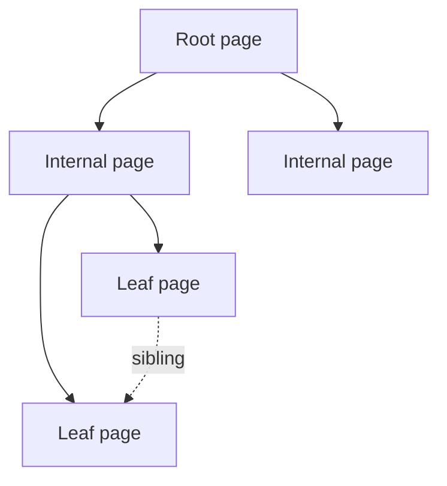

# Day 029: B-Trees

Chapter 4 | B-tree experiment

Work with page-oriented trees and observe access patterns.

## Summary

B-trees keep data sorted in fixed-size pages linked by pointers, optimizing for disk block reads. Inserts and updates happen in place within pages when space allows; overflow splits a page and adjusts parent keys. Point lookups touch O(log n) pages, often fewer than a full table scan. Sequential key inserts can cause localized splits; random inserts spread splits across the tree.

> These notes and diagrams are original study aids for this repo, not copies of DDIA figures or prose. Read the matching section in your own copy of the book.

## Key points

- Pages are the unit of read/write; tree height stays shallow with branching factor B.
- In-place updates work until a page fills, then splits propagate upward.
- Range scans follow leaf sibling links without repeated root descent.
- Delete-heavy workloads may leave underfilled pages until merge/rebalance runs.

## Diagram

B-tree page hierarchy with leaf sibling links for range scans.



## Today

1. Read the matching DDIA section in your own copy of the book.
2. Skim [WORKFLOW.md](../WORKFLOW.md) if you need the shared checklist.
3. Run the starter, then do Try this / Break it / Measure.

### Run the starter

```bash
cd workbook/starter
python3 main.py --help
python3 main.py
```

See [workbook/starter/README.md](./workbook/starter/README.md).

### Try this

Use Postgres or a small B-tree lib. Insert sequential vs random keys; compare page splits / index size if visible.

### Break it

Delete a large key range. Does space get reclaimed the way you expect?

### Measure

Insert rate and index size for sequential vs random.

## Done when

- [ ] You can explain the idea simply
- [ ] You ran the starter and captured output
- [ ] You changed one variable or failure mode and noted what happened
- [ ] You wrote one trade-off you would defend in a design review

Workbook: [workbook/exercise.md](./workbook/exercise.md)
