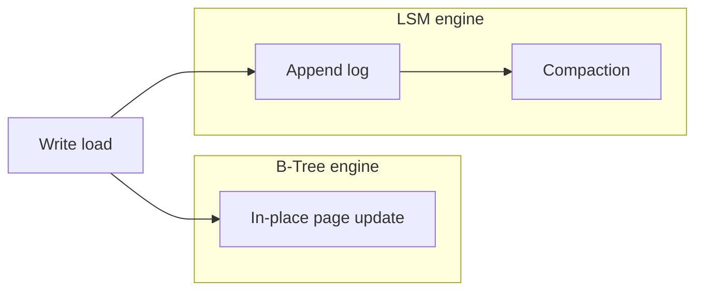

# Day 030: B-Tree vs LSM

Chapter 4 | Benchmark report

Benchmark read-heavy and write-heavy workloads on both styles.

## Summary

B-trees optimize for in-place updates and predictable read latency with minimal segment fan-out. LSM trees batch writes into sequential appends and defer work to compaction, excelling on write-heavy streams. Read-heavy point queries often favor B-trees; write-heavy ingestion favors LSM until compaction debt grows. Update-heavy keys amplify writes in both models but through different mechanisms (page rewrites vs new log entries).

> These notes and diagrams are original study aids for this repo, not copies of DDIA figures or prose. Read the matching section in your own copy of the book.

## Key points

- B-tree reads touch few pages; LSM reads may consult many segments before compaction.
- LSM writes are append-fast; B-tree writes may cause splits and random I/O.
- Compaction shifts LSM cost from write path to background merge work.
- Workload shape (read/write/update ratio) should drive engine choice.

## Diagram

contrasting write paths for page-oriented B-tree vs append-then-compact LSM.



## Today

1. Read the matching DDIA section in your own copy of the book.
2. Skim [WORKFLOW.md](../WORKFLOW.md) if you need the shared checklist.
3. Run the starter, then do Try this / Break it / Measure.

### Run the starter

```bash
cd workbook/starter
python3 main.py --help
python3 main.py
```

See [workbook/starter/README.md](./workbook/starter/README.md).

### Try this

Compare Postgres (B-tree-ish) vs an LSM (RocksDB/LevelDB) or your toy LSM, for write-heavy then read-heavy loads.

### Break it

Create update-heavy keys (read-modify-write). Which engine suffers more?

### Measure

ops/s and space amplification for each workload.

## Done when

- [ ] You can explain the idea simply
- [ ] You ran the starter and captured output
- [ ] You changed one variable or failure mode and noted what happened
- [ ] You wrote one trade-off you would defend in a design review

Workbook: [workbook/exercise.md](./workbook/exercise.md)
