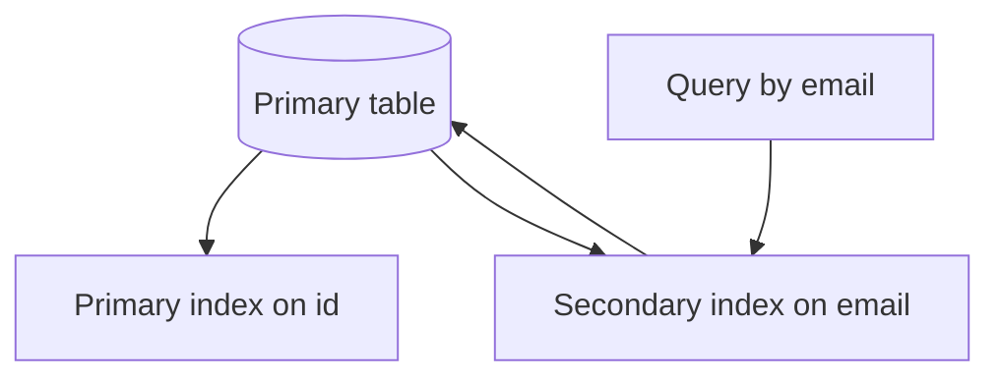

# Day 031: Secondary Indexes

Chapter 4 | Index experiment

Build and compare a secondary-index approach.

## Summary

A secondary index maps non-primary-key columns back to row identifiers so filters avoid full scans. Every indexed column change must update both the heap record and the index entry, write amplification rises. Unique secondary indexes enforce constraints; non-unique indexes may store lists of row pointers. Choosing which columns to index is a trade-off between query speed and write cost.

> These notes and diagrams are original study aids for this repo, not copies of DDIA figures or prose. Read the matching section in your own copy of the book.

## Key points

- Secondary indexes are separate structures keyed by indexed column values.
- Writes may touch primary storage plus every affected index.
- Index-only answers are impossible unless the index covers needed columns.
- Hot updates on indexed fields dominate write amplification.

## Diagram

query routed through secondary index back to primary rows.



## Today

1. Read the matching DDIA section in your own copy of the book.
2. Skim [WORKFLOW.md](../WORKFLOW.md) if you need the shared checklist.
3. Run the starter, then do Try this / Break it / Measure.

### Run the starter

```bash
cd workbook/starter
python3 main.py --help
python3 main.py
```

See [workbook/starter/README.md](./workbook/starter/README.md).

### Try this

Primary key lookup vs secondary index on email/status. Measure write cost with and without the secondary index.

### Break it

Update the indexed field on hot rows. Quantify write amplification.

### Measure

Write latency delta; read latency for filtered queries.

## Done when

- [ ] You can explain the idea simply
- [ ] You ran the starter and captured output
- [ ] You changed one variable or failure mode and noted what happened
- [ ] You wrote one trade-off you would defend in a design review

Workbook: [workbook/exercise.md](./workbook/exercise.md)
