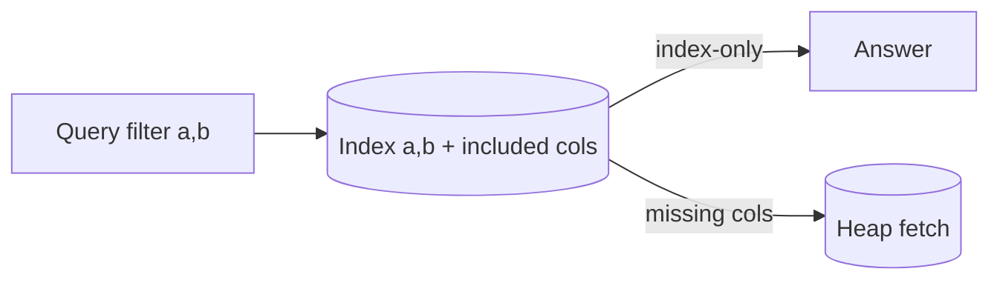

# Day 032: Multicolumn and Covering Indexes

Chapter 4 | SQL benchmark

See how column order and covering indexes change plans.

## Summary

Multicolumn indexes encode keys as tuples; leftmost prefix rules decide which filters can use the index. Column order should match the most selective leading filters in composite queries. Covering indexes include extra columns so some queries avoid heap fetches entirely. Wrong column order or missing INCLUDE columns can silently force expensive table lookups.

> These notes and diagrams are original study aids for this repo, not copies of DDIA figures or prose. Read the matching section in your own copy of the book.

## Key points

- Composite index (a,b) helps filters on a and (a,b), not b alone.
- Selectivity and query mix should determine leading column choice.
- Covering indexes trade storage for index-only scan opportunities.
- Planner choices depend on statistics and correlation between columns.

## Diagram

multicolumn index serving filters vs falling back to heap fetches.



## Today

1. Read the matching DDIA section in your own copy of the book.
2. Skim [WORKFLOW.md](../WORKFLOW.md) if you need the shared checklist.
3. Run the starter, then do Try this / Break it / Measure.

### Run the starter

```bash
cd workbook/starter
python3 main.py --help
python3 main.py
```

See [workbook/starter/README.md](./workbook/starter/README.md).

### Try this

In Postgres, create `(a,b)` vs `(b,a)` indexes. Run queries that filter on a, on b, and on both. Read EXPLAIN.

### Break it

Add INCLUDE columns (or select-only indexed cols) and check for index-only scans.

### Measure

Whether the planner uses your index; heap fetches avoided.

## Done when

- [ ] You can explain the idea simply
- [ ] You ran the starter and captured output
- [ ] You changed one variable or failure mode and noted what happened
- [ ] You wrote one trade-off you would defend in a design review

Workbook: [workbook/exercise.md](./workbook/exercise.md)
