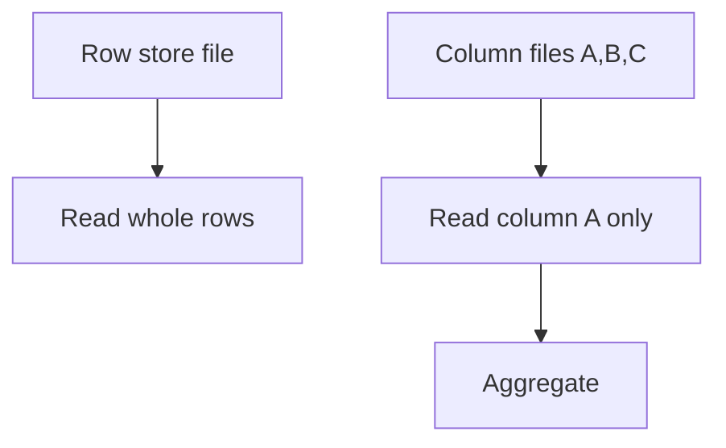

# Day 033: Column-Oriented Storage

Chapter 4 | Columnar experiment

Turn rows into columns and measure analytical scans.

## Summary

Column stores physically group values per column, so analytical queries read only needed fields. Compression improves because adjacent values in one column often share patterns. Row-oriented layouts win for wide point lookups that touch many columns at once. ETL and batch analytics commonly favor columnar; OLTP row stores favor single-row access.

> These notes and diagrams are original study aids for this repo, not copies of DDIA figures or prose. Read the matching section in your own copy of the book.

## Key points

- Column files enable scanning one attribute without reading others.
- Run-length and dictionary encoding shrink repetitive analytical data.
- Insert/update on many columns can be slower than row stores.
- Wide SELECT * workloads defeat columnar I/O savings.

## Diagram

row store reads full records vs column store reading one attribute.



## Today

1. Read the matching DDIA section in your own copy of the book.
2. Skim [WORKFLOW.md](../WORKFLOW.md) if you need the shared checklist.
3. Run the starter, then do Try this / Break it / Measure.

### Run the starter

```bash
cd workbook/starter
python3 main.py --help
python3 main.py
```

See [workbook/starter/README.md](./workbook/starter/README.md).

### Try this

Store the same table as row CSV and as per-column files. Aggregate one column vs touch all columns.

### Break it

Select `*` style access on columnar layout. When does it lose?

### Measure

Bytes read and time for aggregate vs wide select.

## Done when

- [ ] You can explain the idea simply
- [ ] You ran the starter and captured output
- [ ] You changed one variable or failure mode and noted what happened
- [ ] You wrote one trade-off you would defend in a design review

Workbook: [workbook/exercise.md](./workbook/exercise.md)
