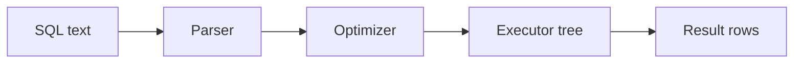

# Day 034: Query Execution

Chapter 4 | Query plan analysis

Trace parse -> plan -> execute -> return.

## Summary

Query engines parse SQL into an AST, optimize into a physical plan, then execute operator trees. Plans choose index seeks vs sequential scans, join orders, and aggregation strategies. EXPLAIN output reveals estimated vs actual row counts, large gaps hint at stale statistics. Rewriting queries or adding indexes changes operator choices, not only constants.

> These notes and diagrams are original study aids for this repo, not copies of DDIA figures or prose. Read the matching section in your own copy of the book.

## Key points

- Logical plans compile to physical operators (scan, filter, join, aggregate).
- Cost model picks among alternatives using table stats and index availability.
- Actual runtime can diverge when estimates are wrong or data is skewed.
- Understanding plans helps distinguish missing indexes from inherent scan cost.

## Diagram

SQL moving through parse, optimize, and execute stages.



## Today

1. Read the matching DDIA section in your own copy of the book.
2. Skim [WORKFLOW.md](../WORKFLOW.md) if you need the shared checklist.
3. Run the starter, then do Try this / Break it / Measure.

### Run the starter

```bash
cd workbook/starter
python3 main.py --help
python3 main.py
```

See [workbook/starter/README.md](./workbook/starter/README.md).

### Try this

Take 3 SQL queries; capture EXPLAIN (ANALYZE). Rewrite one to change the plan (index, rewrite JOIN order).

### Break it

Disable an index and re-run. What does the plan fall back to?

### Measure

Actual rows vs estimated rows; time in each node.

## Done when

- [ ] You can explain the idea simply
- [ ] You ran the starter and captured output
- [ ] You changed one variable or failure mode and noted what happened
- [ ] You wrote one trade-off you would defend in a design review

Workbook: [workbook/exercise.md](./workbook/exercise.md)
