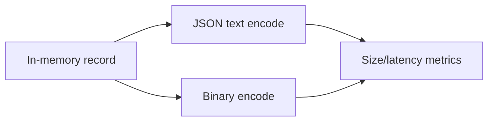

# Day 035: Encoding Fundamentals

Chapter 5 | Encoding benchmark

Compare text vs binary encodings for size, speed, and evolution.

## Summary

Serialization translates in-memory structures into bytes for storage or network transfer. Text formats like JSON prioritize human readability but carry field-name overhead. Binary encodings pack typed values tightly and decode faster at the cost of schema coupling. Encoding choice affects bandwidth, storage, and how safely schemas can evolve.

> These notes and diagrams are original study aids for this repo, not copies of DDIA figures or prose. Read the matching section in your own copy of the book.

## Key points

- JSON is self-describing; binary formats often need external or embedded schemas.
- Numeric and repeated fields compress better in typed binary layouts.
- Cross-language compatibility depends on a well-specified type mapping.
- Evolution rules differ: some formats ignore unknown fields, others fail hard.

## Diagram

same record encoded as human-readable text vs compact binary.



## Today

1. Read the matching DDIA section in your own copy of the book.
2. Skim [WORKFLOW.md](../WORKFLOW.md) if you need the shared checklist.
3. Run the starter, then do Try this / Break it / Measure.

### Run the starter

```bash
cd workbook/starter
python3 main.py --help
python3 main.py
```

See [workbook/starter/README.md](./workbook/starter/README.md).

### Try this

Serialize the same records as JSON, a compact binary (msgpack/protobuf), and maybe CSV. Measure size and encode/decode time.

### Break it

Change a field type incompatibly. Which formats fail loudly vs silently?

### Measure

Bytes/record and encode µs.

## Done when

- [ ] You can explain the idea simply
- [ ] You ran the starter and captured output
- [ ] You changed one variable or failure mode and noted what happened
- [ ] You wrote one trade-off you would defend in a design review

Workbook: [workbook/exercise.md](./workbook/exercise.md)
