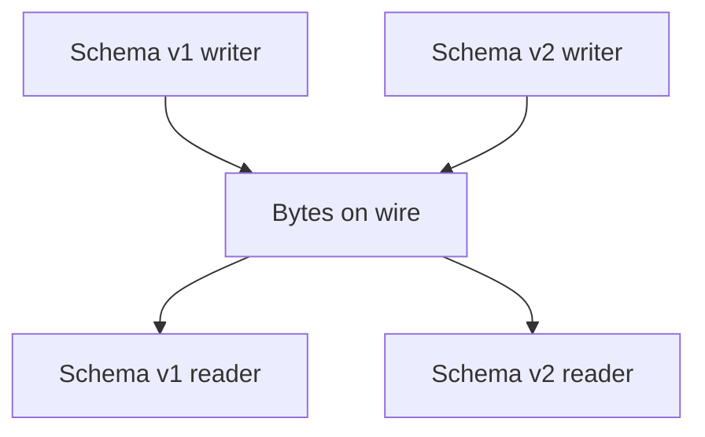

# Day 036: Schema Evolution

Chapter 5 | Compatibility test

Evolve a schema while old readers/writers keep working.

## Summary

Real systems deploy producers and consumers at different times, so schemas must evolve without breaking peers. Forward compatibility lets old code read new data; backward compatibility lets new code read old data. Optional fields, defaults, and never-reusing identifiers are practical rules that prevent silent corruption. Breaking changes need explicit migration windows and dual-write/dual-read bridges.

> These notes and diagrams are original study aids for this repo, not copies of DDIA figures or prose. Read the matching section in your own copy of the book.

## Key points

- Treat field additions as optional with defaults for older readers.
- Avoid changing the meaning of existing fields in place.
- Compatibility is a matrix: old/new reader × old/new writer.
- Breaking changes require coordinated rollout or translation layers.

## Diagram

multiple schema versions reading and writing the same byte stream.



## Today

1. Read the matching DDIA section in your own copy of the book.
2. Skim [WORKFLOW.md](../WORKFLOW.md) if you need the shared checklist.
3. Run the starter, then do Try this / Break it / Measure.

### Run the starter

```bash
cd workbook/starter
python3 main.py --help
python3 main.py
```

See [workbook/starter/README.md](./workbook/starter/README.md).

### Try this

Define v1 and v2 of a record (add optional field, rename carefully). Test old reader + new writer and the reverse.

### Break it

Make a breaking change on purpose. Document the migration bridge you need.

### Measure

Pass/fail matrix for forward and backward compatibility.

## Done when

- [ ] You can explain the idea simply
- [ ] You ran the starter and captured output
- [ ] You changed one variable or failure mode and noted what happened
- [ ] You wrote one trade-off you would defend in a design review

Workbook: [workbook/exercise.md](./workbook/exercise.md)
