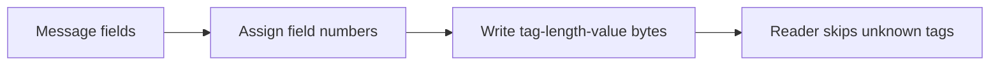

# Day 037: Protocol Buffers

Chapter 5 | Proto evolution lab

Version messages and test compatibility with field numbers.

## Summary

Protocol Buffers tag each field with a numeric identifier separate from the name, enabling name changes without breaking wire format. Unknown fields are preserved or skipped depending on parser settings, aiding forward compatibility. Field numbers must never be recycled for different types, a classic footgun causing silent misinterpretation. This lab simulates proto-style tagged fields using stdlib struct and JSON metadata.

> These notes and diagrams are original study aids for this repo, not copies of DDIA figures or prose. Read the matching section in your own copy of the book.

## Key points

- On-wire format keys data by field number, not field name.
- New optional fields can be added without breaking old parsers.
- Never reuse a field number for a different semantic meaning.
- Varint and length-prefix encodings keep small integers compact.

## Diagram

tagged field encoding with unknown-field skip for forward compatibility.



## Today

1. Read the matching DDIA section in your own copy of the book.
2. Skim [WORKFLOW.md](../WORKFLOW.md) if you need the shared checklist.
3. Run the starter, then do Try this / Break it / Measure.

### Run the starter

```bash
cd workbook/starter
python3 main.py --help
python3 main.py
```

See [workbook/starter/README.md](./workbook/starter/README.md).

### Try this

Write a `.proto`, generate code, add a field with a new number. Decode old bytes with new code and new bytes with old code.

### Break it

Reuse a field number for a different meaning. Observe the footgun.

### Measure

Compatibility results and a rule you will follow for field numbers.

## Done when

- [ ] You can explain the idea simply
- [ ] You ran the starter and captured output
- [ ] You changed one variable or failure mode and noted what happened
- [ ] You wrote one trade-off you would defend in a design review

Workbook: [workbook/exercise.md](./workbook/exercise.md)
