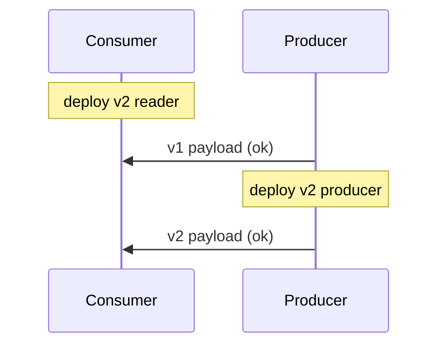

# Day 039: Dataflow Compatibility

Chapter 5 | Deployment simulation

Reason about producer/consumer deploy order.

## Summary

Stream and batch pipelines fail when producers emit data consumers cannot parse, or vice versa. Safe rollout often deploys consumers before producers when adding fields, and the reverse when removing. Rolling back one side without the other creates windows of parse errors or silent data loss. Explicit compatibility checklists beat ad-hoc deploy order every time.

> These notes and diagrams are original study aids for this repo, not copies of DDIA figures or prose. Read the matching section in your own copy of the book.

## Key points

- Adding fields: new consumers first, then producers.
- Removing fields: stop producing first, then deploy consumers that ignore them.
- Dual schemas may coexist during migration windows.
- Rollback plans must consider both upstream and downstream versions.

## Diagram

safe add-field rollout with consumer upgraded before producer.



## Today

1. Read the matching DDIA section in your own copy of the book.
2. Skim [WORKFLOW.md](../WORKFLOW.md) if you need the shared checklist.
3. Run the starter, then do Try this / Break it / Measure.

### Run the starter

```bash
cd workbook/starter
python3 main.py --help
python3 main.py
```

See [workbook/starter/README.md](./workbook/starter/README.md).

### Try this

Script a timeline: deploy consumers first, then producers (and the reverse) for a schema change. Mark when the pipeline is unsafe.

### Break it

Roll back the producer after consumers expect the new field.

### Measure

Safe deploy order written as a checklist.

## Done when

- [ ] You can explain the idea simply
- [ ] You ran the starter and captured output
- [ ] You changed one variable or failure mode and noted what happened
- [ ] You wrote one trade-off you would defend in a design review

Workbook: [workbook/exercise.md](./workbook/exercise.md)
