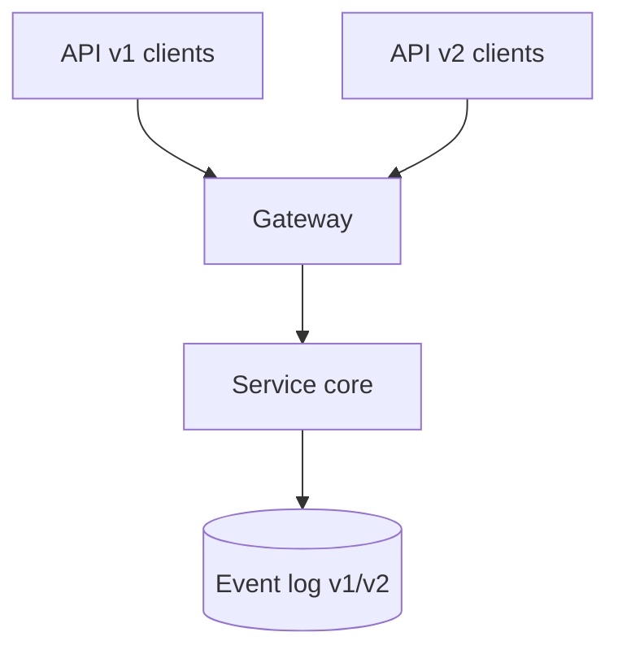

# Day 040: API and Event Evolution

Chapter 5 | Evolution ADR

Design evolution for APIs and events across services.

## Summary

Public APIs and immutable event logs long outlive individual service deploys, so versioning strategy is part of the product. Additive JSON fields and parallel event types preserve old clients while new features roll out. Deprecation timelines communicate when breaking changes will arrive. Events are especially sticky: consumers replay history, so schema changes need even stricter compatibility rules.

> These notes and diagrams are original study aids for this repo, not copies of DDIA figures or prose. Read the matching section in your own copy of the book.

## Key points

- Prefer additive changes with explicit version headers or event types.
- Document sunset dates for deprecated fields and endpoints.
- Event consumers may process old records days or years later.
- Contract tests between producers and consumers catch drift early.

## Diagram

gateway serving multiple API versions feeding versioned events.



## Today

1. Read the matching DDIA section in your own copy of the book.
2. Skim [WORKFLOW.md](../WORKFLOW.md) if you need the shared checklist.
3. Run the starter, then do Try this / Break it / Measure.

### Run the starter

```bash
cd workbook/starter
python3 main.py --help
python3 main.py
```

See [workbook/starter/README.md](./workbook/starter/README.md).

### Try this

Write an ADR: versioning strategy for a REST/JSON API and a parallel event. Include deprecation timeline.

### Break it

Two services upgrade a week apart. What still works?

### Measure

Compatibility guarantees you promise clients.

## Done when

- [ ] You can explain the idea simply
- [ ] You ran the starter and captured output
- [ ] You changed one variable or failure mode and noted what happened
- [ ] You wrote one trade-off you would defend in a design review

Workbook: [workbook/exercise.md](./workbook/exercise.md)
