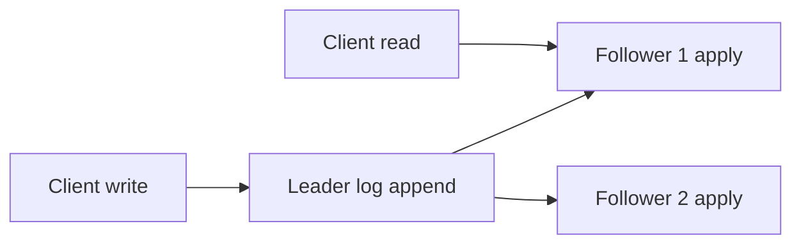

# Day 041: Leader-Follower Replication

Chapter 6 | Replication prototype

Build a tiny leader/follower replication log.

## Summary

Leader-follower replication sends all writes through one primary node that appends to a replication log. Followers tail the log and apply entries in order to maintain copies. Reads can hit followers for scale but may be stale depending on lag. Failover promotes a follower when the leader stops, introducing brief unavailability and consistency questions.

> These notes and diagrams are original study aids for this repo, not copies of DDIA figures or prose. Read the matching section in your own copy of the book.

## Key points

- Single leader serializes writes; followers are read replicas of the log.
- Replication is log shipping: same ordered entries applied on each node.
- Follower lag is normal under load or slow networks.
- Leader failure triggers election or manual promotion workflows.

## Diagram

leader append fan-out to followers applying the same ordered log.



## Today

1. Read the matching DDIA section in your own copy of the book.
2. Skim [WORKFLOW.md](../WORKFLOW.md) if you need the shared checklist.
3. Run the starter, then do Try this / Break it / Measure.

### Run the starter

```bash
cd workbook/starter
python3 main.py --help
python3 main.py
```

See [workbook/starter/README.md](./workbook/starter/README.md).

### Try this

Leader appends to a log file; follower tails and applies. Client writes go to leader only.

### Break it

Kill the leader mid-replicate. What is on the follower? Who becomes writable?

### Measure

Lag in entries and time-to-catch-up.

## Done when

- [ ] You can explain the idea simply
- [ ] You ran the starter and captured output
- [ ] You changed one variable or failure mode and noted what happened
- [ ] You wrote one trade-off you would defend in a design review

Workbook: [workbook/exercise.md](./workbook/exercise.md)
