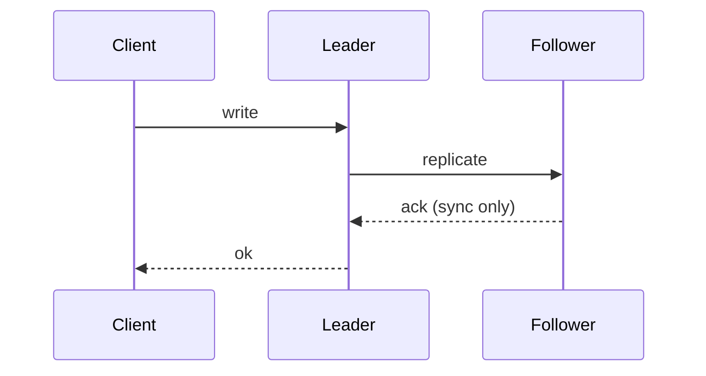

# Day 042: Synchronous vs Asynchronous Replication

Chapter 6 | Replication benchmark

Measure latency vs durability when followers are slow.

## Summary

Synchronous replication waits for follower acknowledgment before confirming a write to the client. Asynchronous replication returns after the leader persists locally, forwarding changes in the background. Sync tightens durability bounds but stretches latency when followers are distant or slow. Async minimizes write latency but can lose recent commits if the leader fails before replication completes.

> These notes and diagrams are original study aids for this repo, not copies of DDIA figures or prose. Read the matching section in your own copy of the book.

## Key points

- Sync ACK means at least one follower has the entry before client success.
- Async ACK returns when the leader alone has durably stored the write.
- Follower delay directly adds to sync write latency.
- Durability vs latency is the core trade-off between sync and async modes.

## Diagram

sync path waits for follower ack; async can ack before replicate completes.



## Today

1. Read the matching DDIA section in your own copy of the book.
2. Skim [WORKFLOW.md](../WORKFLOW.md) if you need the shared checklist.
3. Run the starter, then do Try this / Break it / Measure.

### Run the starter

```bash
cd workbook/starter
python3 main.py --help
python3 main.py
```

See [workbook/starter/README.md](./workbook/starter/README.md).

### Try this

ACK after local write (async) vs ACK after follower confirm (sync). Inject follower delay.

### Break it

Lose the leader after async ACK. Prove data loss is possible.

### Measure

Write latency and durability outcome for both modes.

## Done when

- [ ] You can explain the idea simply
- [ ] You ran the starter and captured output
- [ ] You changed one variable or failure mode and noted what happened
- [ ] You wrote one trade-off you would defend in a design review

Workbook: [workbook/exercise.md](./workbook/exercise.md)
