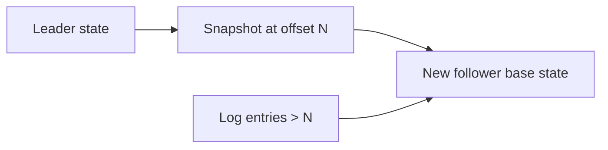

# Day 043: Follower Bootstrap

Chapter 6 | Recovery exercise

Simulate snapshot + log catch-up for a new follower.

## Summary

New followers cannot replay an entire historical log from genesis efficiently, so they start from a consistent snapshot. The snapshot captures state at a known log offset; subsequent entries replay on top to catch up. Applying entries from before the snapshot would double-apply or corrupt state unless detected. Bootstrap duration trades snapshot size against replay length.

> These notes and diagrams are original study aids for this repo, not copies of DDIA figures or prose. Read the matching section in your own copy of the book.

## Key points

- Snapshot = point-in-time state + log offset marker (LSN/offset).
- Catch-up replays only entries after the snapshot position.
- Duplicate or stale log entries must be rejected during bootstrap.
- Snapshot frequency affects recovery time and storage overhead.

## Diagram

new follower loads snapshot then replays log tail.



## Today

1. Read the matching DDIA section in your own copy of the book.
2. Skim [WORKFLOW.md](../WORKFLOW.md) if you need the shared checklist.
3. Run the starter, then do Try this / Break it / Measure.

### Run the starter

```bash
cd workbook/starter
python3 main.py --help
python3 main.py
```

See [workbook/starter/README.md](./workbook/starter/README.md).

### Try this

Take a snapshot of leader state, then replay log entries after the snapshot LSN/offset.

### Break it

Apply log entries from before the snapshot. Detect and reject them.

### Measure

Bootstrap time and correctness check (follower == leader).

## Done when

- [ ] You can explain the idea simply
- [ ] You ran the starter and captured output
- [ ] You changed one variable or failure mode and noted what happened
- [ ] You wrote one trade-off you would defend in a design review

Workbook: [workbook/exercise.md](./workbook/exercise.md)
