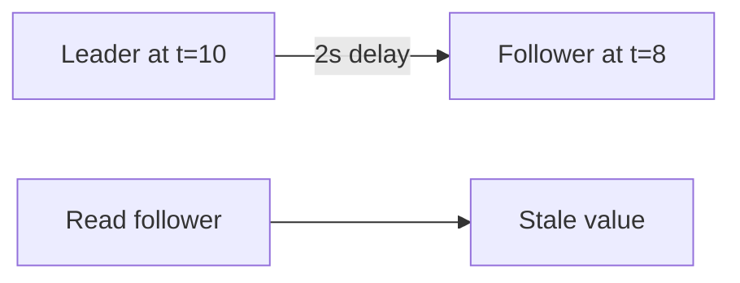

# Day 044: Replication Lag

Chapter 6 | Lag experiment

Inject lag and reproduce stale reads.

## Summary

Replication lag is the time (or entry count) a follower trails the leader. Under load, network limits, or large transactions, lag grows and followers serve outdated reads. Monitoring lag percentiles matters more than mean lag for user-visible staleness. Applications must decide whether stale reads are acceptable or route critical reads elsewhere.

> These notes and diagrams are original study aids for this repo, not copies of DDIA figures or prose. Read the matching section in your own copy of the book.

## Key points

- Lag can be measured in seconds or in unreplicated log entries.
- Heavy writes and slow followers increase tail lag.
- Stale reads are expected unless you wait or route to leader.
- Sudden lag spikes often correlate with batch jobs or network issues.

## Diagram

delayed follower serving a read behind the leader timeline.



## Today

1. Read the matching DDIA section in your own copy of the book.
2. Skim [WORKFLOW.md](../WORKFLOW.md) if you need the shared checklist.
3. Run the starter, then do Try this / Break it / Measure.

### Run the starter

```bash
cd workbook/starter
python3 main.py --help
python3 main.py
```

See [workbook/starter/README.md](./workbook/starter/README.md).

### Try this

Read from follower while artificial delay is applied. Show a write that is missing on the follower for N seconds.

### Break it

Route a user to a lagging follower after they wrote on the leader.

### Measure

Lag seconds and stale-read rate under your workload.

## Done when

- [ ] You can explain the idea simply
- [ ] You ran the starter and captured output
- [ ] You changed one variable or failure mode and noted what happened
- [ ] You wrote one trade-off you would defend in a design review

Workbook: [workbook/exercise.md](./workbook/exercise.md)
