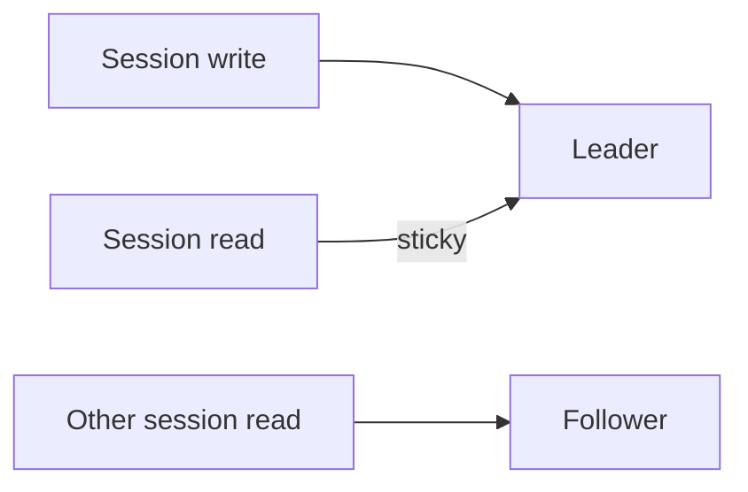

# Day 045: Read-Your-Writes

Chapter 6 | Consistency lab

Implement session-aware routing so users see their own writes.

## Summary

Users expect to read their own recent writes even when reads normally go to followers. Session stickiness routes post-write reads to the leader or a caught-up replica for that session. Alternatively, wait until replication lag drops below a threshold before serving reads. Without session awareness, read-your-writes violations confuse users after form submits or profile updates.

> These notes and diagrams are original study aids for this repo, not copies of DDIA figures or prose. Read the matching section in your own copy of the book.

## Key points

- Read-your-writes is a session guarantee, not global linearizability.
- Sticky routing ties a session to leader or lag-aware replica selection.
- Version tokens or write timestamps help detect stale session reads.
- Mobile clients switching regions need careful session affinity design.

## Diagram

same session reads leader after write; other sessions may read followers.



## Today

1. Read the matching DDIA section in your own copy of the book.
2. Skim [WORKFLOW.md](../WORKFLOW.md) if you need the shared checklist.
3. Run the starter, then do Try this / Break it / Measure.

### Run the starter

```bash
cd workbook/starter
python3 main.py --help
python3 main.py
```

See [workbook/starter/README.md](./workbook/starter/README.md).

### Try this

After a write, sticky-route that session to the leader (or wait for lag < threshold) before reading.

### Break it

Disable sticky routing. Capture a read-your-writes violation.

### Measure

Violation count with and without the fix.

## Done when

- [ ] You can explain the idea simply
- [ ] You ran the starter and captured output
- [ ] You changed one variable or failure mode and noted what happened
- [ ] You wrote one trade-off you would defend in a design review

Workbook: [workbook/exercise.md](./workbook/exercise.md)
