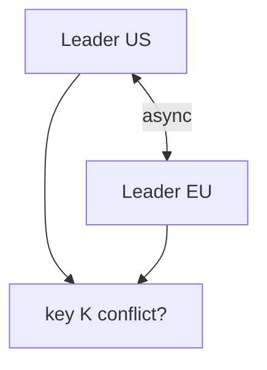

# Day 047: Multi-Leader Replication

Chapter 6 | Conflict lab

Simulate writes in two regions and reconcile.

## Summary

Multi-leader (multi-master) replication accepts writes in more than one region simultaneously. Conflicts arise when two leaders update the same key before changes replicate both ways. Conflict-free replicated data types or application merge rules resolve divergent histories. Multi-leader reduces write latency locally but increases operational complexity and conflict handling.

> These notes and diagrams are original study aids for this repo, not copies of DDIA figures or prose. Read the matching section in your own copy of the book.

## Key points

- Each region can write locally without crossing WAN to a single leader.
- Concurrent updates to one key produce divergent versions that must merge.
- Replication is asynchronous between leaders; causality can be lost without care.
- Conflict rate rises with shared mutable keys across regions.

## Diagram

two leaders accepting writes that may conflict on the same key.



## Today

1. Read the matching DDIA section in your own copy of the book.
2. Skim [WORKFLOW.md](../WORKFLOW.md) if you need the shared checklist.
3. Run the starter, then do Try this / Break it / Measure.

### Run the starter

```bash
cd workbook/starter
python3 main.py --help
python3 main.py
```

See [workbook/starter/README.md](./workbook/starter/README.md).

### Try this

Two leaders accept writes for the same key; replicate both ways. Log conflicts.

### Break it

Concurrent updates to the same shopping cart. What merge policy do you pick?

### Measure

Conflict rate and whether merges are automatic or need human rules.

## Done when

- [ ] You can explain the idea simply
- [ ] You ran the starter and captured output
- [ ] You changed one variable or failure mode and noted what happened
- [ ] You wrote one trade-off you would defend in a design review

Workbook: [workbook/exercise.md](./workbook/exercise.md)
