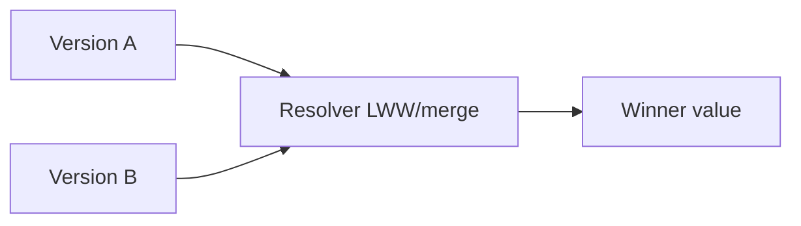

# Day 048: Conflict Resolution

Chapter 6 | Resolver implementation

Implement deterministic conflict resolution (and know its limits).

## Summary

When replicas diverge, a resolver picks the value clients should treat as canonical. Last-write-wins uses timestamps but breaks when clocks skew or semantics need merge, not pick-one. Structured merges (counters, sets, custom logic) preserve intent better for some data types. Every automatic resolver has cases where product rules require human escalation.

> These notes and diagrams are original study aids for this repo, not copies of DDIA figures or prose. Read the matching section in your own copy of the book.

## Key points

- LWW is simple but loses concurrent updates when timestamps lie.
- Version vectors detect true concurrency vs causal ordering.
- Application-specific merges (union, max, CRDT) fit structured data.
- Resolver choice is a product decision, not only a technical default.

## Diagram

divergent versions fed into a deterministic resolver.



## Today

1. Read the matching DDIA section in your own copy of the book.
2. Skim [WORKFLOW.md](../WORKFLOW.md) if you need the shared checklist.
3. Run the starter, then do Try this / Break it / Measure.

### Run the starter

```bash
cd workbook/starter
python3 main.py --help
python3 main.py
```

See [workbook/starter/README.md](./workbook/starter/README.md).

### Try this

Implement last-write-wins (timestamp) and a simple merge (e.g. set-union for tags). Show a case LWW gets wrong.

### Break it

Clock skew makes the 'losing' write look newer. What breaks?

### Measure

Examples where your resolver is wrong for the product.

## Done when

- [ ] You can explain the idea simply
- [ ] You ran the starter and captured output
- [ ] You changed one variable or failure mode and noted what happened
- [ ] You wrote one trade-off you would defend in a design review

Workbook: [workbook/exercise.md](./workbook/exercise.md)
