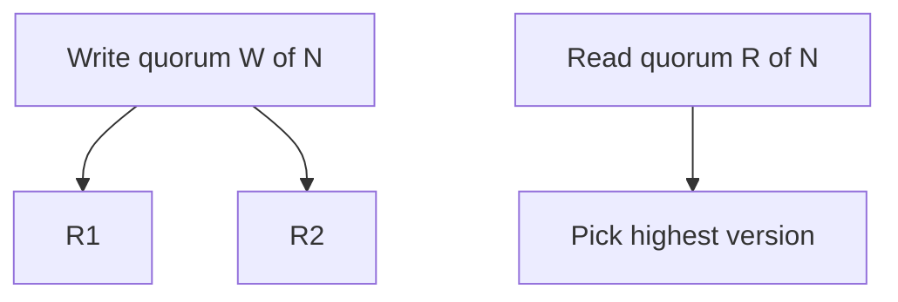

# Day 049: Leaderless Replication

Chapter 6 | Quorum lab

Implement quorum reads/writes (W + R > N).

## Summary

Leaderless designs like Dynamo-style quorums let any replica accept reads and writes with tunable W and R. When W + R > N, read and write replica sets overlap, improving consistency odds without a single leader. Weak quorums (W=1,R=1) maximize availability but frequently return stale or divergent values. Repairs (read repair, anti-entropy) fix drift that quorums temporarily hide.

> These notes and diagrams are original study aids for this repo, not copies of DDIA figures or prose. Read the matching section in your own copy of the book.

## Key points

- N replicas; W nodes must ack write; read from R nodes.
- W + R > N guarantees at least one overlapping node on read/write.
- Sloppy quorums trade strict overlap for availability during failures.
- Versioned values resolve conflicts when replicas disagree.

## Diagram

quorum write to W nodes, read from R nodes, merge by version.



## Today

1. Read the matching DDIA section in your own copy of the book.
2. Skim [WORKFLOW.md](../WORKFLOW.md) if you need the shared checklist.
3. Run the starter, then do Try this / Break it / Measure.

### Run the starter

```bash
cd workbook/starter
python3 main.py --help
python3 main.py
```

See [workbook/starter/README.md](./workbook/starter/README.md).

### Try this

N=3 replicas; try W=2,R=2 and W=1,R=1. Show stale reads with weak quorums.

### Break it

One replica permanently stale. Do strong quorums still protect you?

### Measure

Stale-read frequency vs W/R settings.

## Done when

- [ ] You can explain the idea simply
- [ ] You ran the starter and captured output
- [ ] You changed one variable or failure mode and noted what happened
- [ ] You wrote one trade-off you would defend in a design review

Workbook: [workbook/exercise.md](./workbook/exercise.md)
