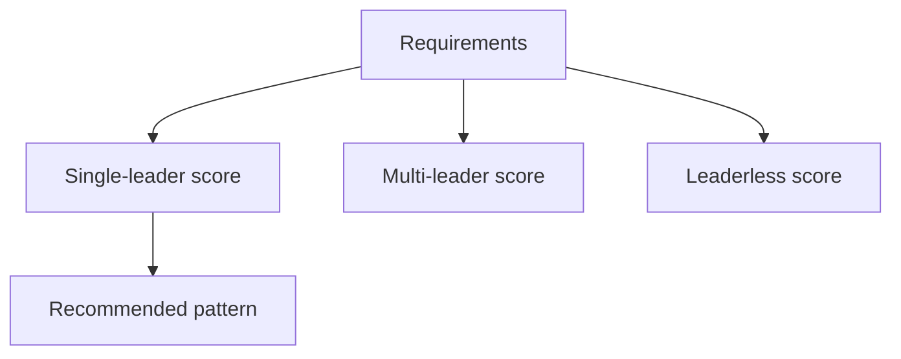

# Day 050: Replication Design Review

Chapter 6 | Architecture review

Choose a replication architecture for a multi-region workload.

## Summary

Replication architecture should follow workload facts: write geography, conflict tolerance, ops budget, and consistency needs. Single-leader is simplest but distant writes pay WAN latency. Multi-leader fits multi-region writes but demands conflict tooling. Leaderless with quorums tunables trades clarity for configurability. A scored decision matrix makes trade-offs explicit before production commits.

> These notes and diagrams are original study aids for this repo, not copies of DDIA figures or prose. Read the matching section in your own copy of the book.

## Key points

- Start from write/read patterns and consistency guarantees users need.
- Single-leader minimizes conflict complexity at the cost of remote write latency.
- Multi-leader optimizes local writes when conflicts are rare or mergeable.
- Document failover, monitoring, and conflict playbooks with the choice.

## Diagram

requirements fed into scoring paths for three replication styles.



## Today

1. Read the matching DDIA section in your own copy of the book.
2. Skim [WORKFLOW.md](../WORKFLOW.md) if you need the shared checklist.
3. Run the starter, then do Try this / Break it / Measure.

### Run the starter

```bash
cd workbook/starter
python3 main.py --help
python3 main.py
```

See [workbook/starter/README.md](./workbook/starter/README.md).

### Try this

Requirements: mostly reads, rare cross-region writes, low ops complexity. Pick single-leader, multi-leader, or leaderless, and defend it.

### Break it

Add a hard requirement for multi-region writes with low conflict. Does your choice hold?

### Measure

Decision table: consistency, lag, ops burden, conflict handling.

## Done when

- [ ] You can explain the idea simply
- [ ] You ran the starter and captured output
- [ ] You changed one variable or failure mode and noted what happened
- [ ] You wrote one trade-off you would defend in a design review

Workbook: [workbook/exercise.md](./workbook/exercise.md)
