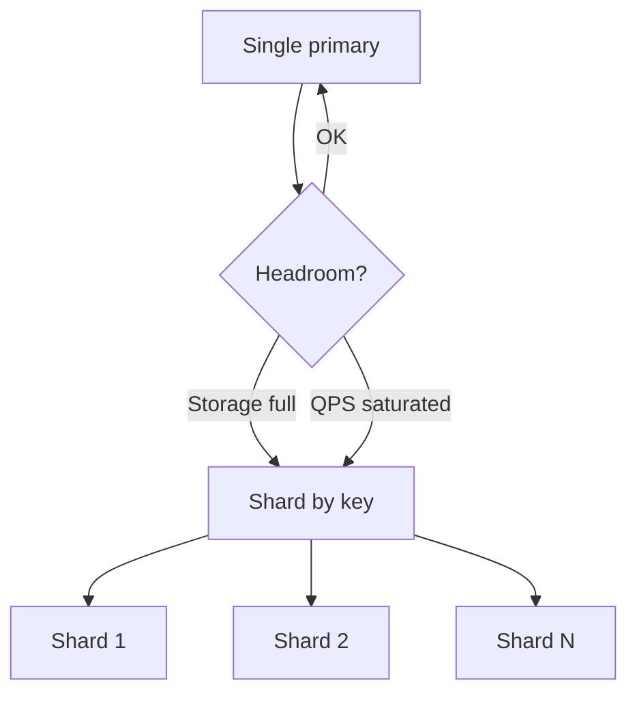

# Day 051: Why Shard

Chapter 7 | Sharding rationale

Decide when a single primary is no longer enough.

## Summary

Vertical scaling eventually hits hard ceilings: one machine has finite CPU, RAM, disk IOPS, and network bandwidth. Sharding splits ownership of data across independent nodes so each node handles a fraction of storage and query load. The trade-off is operational complexity, routing, rebalancing, cross-shard queries, and distributed transactions become your problem.

> These notes and diagrams are original study aids for this repo, not copies of DDIA figures or prose. Read the matching section in your own copy of the book.

## Key points

- Shard when a single node cannot meet storage or throughput SLOs even after tuning.
- Pick a shard key that spreads both data volume and request rate; bad keys create hotspots.
- Each shard should be independently operable (backup, failover, deploy) where possible.
- Cross-shard operations are expensive, design APIs to stay shard-local when you can.
- Plan rebalancing before you need it; growth makes late migrations painful.

## Diagram

Single-node limits push you toward horizontal partition by shard key.



## Today

1. Read the matching DDIA section in your own copy of the book.
2. Skim [WORKFLOW.md](../WORKFLOW.md) if you need the shared checklist.
3. Run the starter, then do Try this / Break it / Measure.

### Run the starter

```bash
cd workbook/starter
python3 main.py --help
python3 main.py
```

See [workbook/starter/README.md](./workbook/starter/README.md).

### Try this

Given growth curves for storage and QPS, calculate when one primary is out. List shard-key candidates.

### Break it

Assume a bad shard key (all hot users on one shard). Quantify imbalance.

### Measure

Storage/QPS headroom and skew ratio.

## Done when

- [ ] You can explain the idea simply
- [ ] You ran the starter and captured output
- [ ] You changed one variable or failure mode and noted what happened
- [ ] You wrote one trade-off you would defend in a design review

Workbook: [workbook/exercise.md](./workbook/exercise.md)
