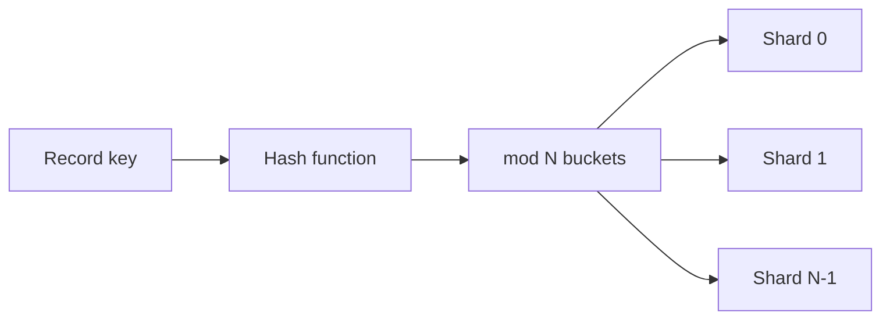

# Day 052: Hash Partitioning

Chapter 7 | Partitioner

Partition by hash and watch key distribution.

## Summary

Hash partitioning maps each record key through a hash function and assigns it to one of N fixed buckets. With a uniform hash and many keys, load tends to spread evenly regardless of key semantics. The cost is losing cheap range scans, neighboring keys land on unrelated shards.

> These notes and diagrams are original study aids for this repo, not copies of DDIA figures or prose. Read the matching section in your own copy of the book.

## Key points

- hash(key) mod N (or consistent hashing) picks the owning shard.
- Uniform key distribution yields roughly equal partition sizes.
- Rebalancing N often requires remapping many keys unless you use consistent hashing.
- Hash partitioning avoids hot trailing ranges but not hot individual keys.
- Choose N with headroom; changing bucket count is a migration event.

## Diagram

Hash the key, modulo N, to pick a shard.



## Today

1. Read the matching DDIA section in your own copy of the book.
2. Skim [WORKFLOW.md](../WORKFLOW.md) if you need the shared checklist.
3. Run the starter, then do Try this / Break it / Measure.

### Run the starter

```bash
cd workbook/starter
python3 main.py --help
python3 main.py
```

See [workbook/starter/README.md](./workbook/starter/README.md).

### Try this

Hash keys into N buckets; load a realistic key set. Plot counts per partition.

### Break it

Use a non-uniform keyspace (power-law user ids). How bad is balance?

### Measure

max/min partition size ratio.

## Done when

- [ ] You can explain the idea simply
- [ ] You ran the starter and captured output
- [ ] You changed one variable or failure mode and noted what happened
- [ ] You wrote one trade-off you would defend in a design review

Workbook: [workbook/exercise.md](./workbook/exercise.md)
