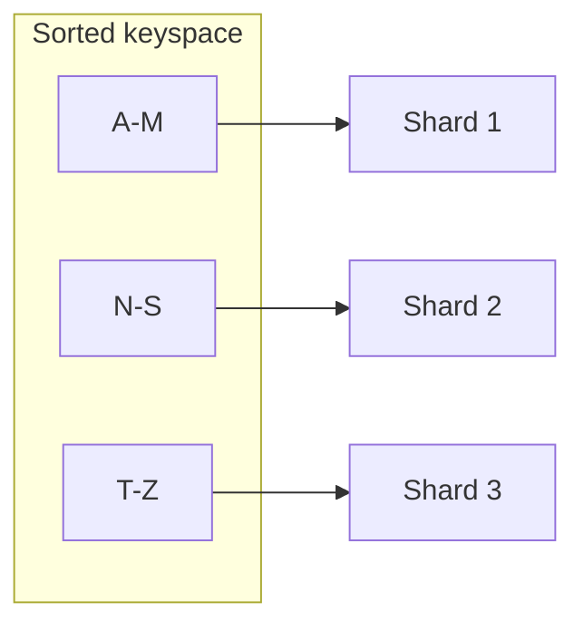

# Day 053: Range Partitioning

Chapter 7 | Range map

Partition by key range; feel hot ranges.

## Summary

Range partitioning assigns contiguous key intervals to shards, great for range queries and time-ordered data. Sequential inserts (timestamps, auto-increment IDs) concentrate writes on the trailing range. Splitting ranges when a partition grows too large is the standard mitigation.

> These notes and diagrams are original study aids for this repo, not copies of DDIA figures or prose. Read the matching section in your own copy of the book.

## Key points

- Each shard owns [min_key, max_key) for some ordering.
- Range scans stay local when predicates align with the partition key.
- Append-heavy workloads often create a hot last partition.
- Dynamic splits merge/split ranges as data grows.
- Skewed access patterns may require manual boundary tuning.

## Diagram

Contiguous key ranges map to shards; the last range absorbs sequential writes.



## Today

1. Read the matching DDIA section in your own copy of the book.
2. Skim [WORKFLOW.md](../WORKFLOW.md) if you need the shared checklist.
3. Run the starter, then do Try this / Break it / Measure.

### Run the starter

```bash
cd workbook/starter
python3 main.py --help
python3 main.py
```

See [workbook/starter/README.md](./workbook/starter/README.md).

### Try this

Split a sorted keyspace into ranges. Insert sequential keys (time-based IDs).

### Break it

All new writes hit the last range. Propose a split strategy.

### Measure

Write share of the hottest range.

## Done when

- [ ] You can explain the idea simply
- [ ] You ran the starter and captured output
- [ ] You changed one variable or failure mode and noted what happened
- [ ] You wrote one trade-off you would defend in a design review

Workbook: [workbook/exercise.md](./workbook/exercise.md)
